# [Unreleased]

These changes are awaiting release:

## Added

- Jellyfin: Automatic tracking via [jellyfin webhook](https://github.com/jellyfin/jellyfin-plugin-webhook).
  - Enable support in your server settings!
- Activity: Created `created_by` & `reason` properties.
- ActivityEditor: Added expandable section for viewing full raw activity.

## Changed

- (NEW MIGRATION) Migrate Jellyfin users to using `user_services` table for auth (deprecating the old ThirdPartyId and ThirdPartyAuth columns in the process).
- (NEW MIGRATION) Activity: Migrate all `_AUTO`, `_JF` & `_PLEX` activities so that they now use the base activity type (affixes dropped), along with the new `created_by` property for telling the difference. `_AUTO` activities have had the `reason` properties that used to be in a JSON blob, moved to the new `reason` column (been normalized). This migration makes activities more flexible and easier to work with on the backend/frontend (I couldn't just keep adding a bunch of new activities for the same thing just to denote a new service created it!).
- User: Changed Password gorm permission to "create only", to avoid loading pass hash into memory unnecessarily. Services that need to read the password field, now use their own specific single use struct.
- Logging: When `debug` logging is enabled, all database queries will be logged to `stdout`.
- Menu: Add border-radius to buttons on hover.
- FaceMenu: Show $error color as bg when hovering over logout button.

## Fixed

- Auth: UserChangePassword: Added `User.Type` check.

## Maintenance

- Organize user entity structs.
- Moved JellyfinAccessRequired middleware to `authmiddleware` package.
- Created `usermiddleware` package with `WithUser` and `WithUserService` middleware. These will help us migrate from the all-encompassing `AuthRequired` middleware (so that it can just stick to purely auth and any routes needing the User from database can add the extra middleware which is more modular).
- Created `tri` package for representing "tribools". Helps us avoid using `*bool` when possible (for inter-watcharr communications).
- Activity:
  - Moved service code to a new top-level activity package (no longer injected into other services that need it).
  - Made a builder API for creating activities (so the builder constructor can have required props, enabling compiler errors for this case & makes the call sites more readable).
  - (frontend) Group component files in a new sub dir.
- WatchedEpisode: Moved request/response structs to `domain` package.
- WatchedSeason: Moved request/response structs to `domain` package.
- Auth: Refactored UserChangePassword func.
- Logging: Refactored func/var names (eg SetLevel -> Level).
- Database: Renamed `New()` to `Open()` as it will no longer run `Setup()`. That will be done from caller after running New(). This lets us setup our logging for the db after New(), but before migrations are run in Setup().
- Middleware: Removed "extra info" from `AuthRequired`. User from db is now fetched with new `WithUser` middleware.
- Upgraded go: 1.26 -> 1.27.

# [4.2.1] - 2026-08-04T00:40:00Z

## Fixed

- ProvidersList: Duplicate key error (that was causing an infinite loading issue for some media).

## Etc

- **Package**: [GitHub CR](https://github.com/orgs/sbondCo/packages/container/watcharr/1095711172?tag=v4.2.1) or [Docker Hub](https://hub.docker.com/layers/sbondco/watcharr/v4.2.1/images/sha256-10100c88751ff6ad4d8d7ea8af9c299adc70cc0cb5e89ccd849d0b0d6e7637a8).

# [4.2.0] - 2026-08-03T07:45:00Z

> [!NOTE]
> v4.2.0 - That's pretty funny right? Hah. Let's all chuckle together :)

## New

- Show `Airs On` date for episodes that have yet to air (thanks [@KarpachMarko]!).
- Show `Aired Date` for episodes.
- Import: Add `rating` column.
- Import(text list): Support parsing a rating (out of 10, supporting decimals) in square brackets.
- Show `End Year` for TV Shows that have ended or been canceled.
- Add full release date and last release date to their respective year elements as titles (browser tooltip).
- Search: Support inline filters for Non-Multi searches (ex: You can now search `Spider Man year:2026` or `Spider Man fyear:2026` if you care strictly about the first release year).
  - You'll find a new `filters` button on the search page that opens a modal explaining usage.

## Changed

- HTTP Requests: Replace `axios` with `Fetch`.

## Fixed

- Login: Display error when request to get available auth providers fails.
- Removed some legacy code that still thought there was a `store.watchedList`.
- DropDown: Fix whole page scrolling when pressing letter to scroll to first relevant dropdown item (only the dropdown list should scroll now, which is less jarring).
- Media pages: Only show PosterImage if we have a poster path.
- Import:
  - Mark import item as failed correctly when error is thrown from doImport.
  - Make the table horizontally scrollable when necessary (instead of just cutting off the end).

## Docs

- Update text import docs to show support for parsing ratings.
- Update `installation/for-development` guide (commands were outdated).

## Maintenance

I have been slacking in this department, so there has been a lot of house cleaning.

- Package.json: Use exact version for all packages.
- .npmrc: Enable `ignore-scripts` (still on npm 11) and set `min-release-age=14`.
- Workflows: Upgrade action versions & set Node version to `24`.
- Dockerfile: Upgrade node steps to use version `24`.
- Workflows: test-pr-server: Set go-version-file for setup-go action.
- Upgrade devDependencies:
  - eslint: 8.57.0 -> 10.7.0
  - eslint-config-prettier: 10.1.2 -> 10.1.8
  - eslint-plugin-svelte: 2.45.1 -> 3.20.0
  - prettier: 3.4.2 -> 3.9.5
  - prettier-plugin-svelte: 3.4.0 -> 4.1.1
  - svelte-eslint-parser: 0.42.0 -> 1.8.0
  - typescript-eslint: 8.32.1 -> 8.63.0
  - @sveltejs/adapter-node: 5.2.12 -> 5.5.7
  - @sveltejs/kit: 2.21.0 -> 2.69.3
  - @vite-pwa/sveltekit: 0.6.6 -> 1.1.0
  - sass: 1.97.3 -> 1.101.0
  - svelte: 5.17.3 -> 5.56.4
  - svelte-check: 4.1.3 -> 4.7.2
  - svelte-preprocess: 6.0.3 -> 6.0.5
  - typescript: 5.8.3 -> 6.0.3 (going to give v7 time to mature before I try it)
  - vite: 6.3.5 -> 8.1.4
- Added devDependencies: `@eslint/js` (new eslint has split this module out into a new package) and `globals` (as a result of new eslint architecture, we now have this as a direct dev dependency).
- ESLint: Migrate to flat config: I ran `npx sv add eslint` and modified the eslint.config.js it generated to line up better with our old one and work a bit better (i think) with our normal ts files. Also set `ecmaVersion` to `latest`, previously was `2020`.
- Moved `env.d.ts` to `src` directory (which is covered by svelte-kits include) so that we can drop the custom `include` in our `tsconfig.json` (which when out of sync with the generated tsconfig by svelte-kit can lead to headaches because it's not immediately obvious, so this change will eliminate that dev time footgun).
- Fixed lots of new (and probably old which may not have been applying with the old bad config) {ts,svelte} eslint rules, improving code quality.
- Finally made tmdb media package function like the igdb media package, so that our direct tmdb interfacing code is neatly tucked away and isn't infesting the Content package (probs some more improvements I could make in regards to db caching, but that is for the future).
- Upgrade server dependencies:
  - go: 1.25 -> 1.26
  - github.com/gin-contrib/cache: v1.4.1 -> v1.4.4
  - github.com/gin-contrib/cors: v1.7.6 -> v1.7.7
  - github.com/gin-gonic/gin: v1.11.0 -> v1.12.0
  - github.com/go-co-op/gocron/v2: v2.16.2 -> v2.22.0
  - github.com/go-playground/validator/v10: v10.27.0 -> v10.30.3
  - github.com/golang-jwt/jwt/v5: v5.2.2 -> v5.3.1
  - golang.org/x/crypto: v0.40.0 -> v0.54.0
  - gorm.io/gorm: v1.31.1: -> v1.31.2

## Etc

- **Package**: [GitHub CR](https://github.com/orgs/sbondCo/packages/container/watcharr/1092583539?tag=v4.2.0) or [Docker Hub](https://hub.docker.com/layers/sbondco/watcharr/v4.2.0/images/sha256-1063b31d3254fe74ca1960eb78c1992dc809b4f7122b4d28547337a9fb8afc51).

# [4.1.1] - 2026-07-26T02:00:00Z

## Fixed

- Plex Login: Request JSON from plex api so that it doesn't return XML.
- GHSA-6x53-2w54-v5rj (thanks to [@tonghuaroot] for reporting and patching!)

## Etc

- **Package**: [GitHub CR](https://github.com/sbondCo/Watcharr/pkgs/container/watcharr/1066968415?tag=v4.1.1) or [Docker Hub](https://hub.docker.com/layers/sbondco/watcharr/v4.1.1/images/sha256-e71e9006e22e8111230ae2fc0e8a66c2b6de75112c784a11ab1b45faffeb8e8a).

# [4.1.0] - 2026-07-19T14:18:00Z

## Changed

- Profile: Stats no longer care about the `Include Previously Watched` setting. All previously watched items will be counted in the stats now.
- Activity: Added `index` to `WatchedID` column to speed up queries.
- SeasonsListEpisode when `Hide Spoilers` is on (thanks [@goestav]!):
  - Show episode spoilers if its status is `FINISHED`;
  - Allow changing status without showing spoilers (useful for when setting an episode to PLANNED, etc).

## Fixed

- `Include Previously Watched` regression (fixes https://github.com/sbondCo/Watcharr/issues/1027).

## Maintenance

- Remove `dependabot.yml`.

## Etc

- **Package**: [GitHub CR](https://github.com/orgs/sbondCo/packages/container/watcharr/1045300036?tag=v4.1.0) or [Docker Hub](https://hub.docker.com/layers/sbondco/watcharr/v4.1.0/images/sha256-8148b4bdd81e7fc2b412a4dd0a0a2bafa478bd42ab6d9824f9be10d1763719f4).

# [4.0.1] - 2026-07-16T10:12:00Z

## Changed

- Move notifications to its own component.
- Use an `svg` for the favicon and change its `fill` to `white` for dark themed browsers.

## Fixed

- SpinnerTiny: Use svg instead of the css border trick to create the spinner fixing it looking more like a horseshoe than a circle on different browser scales (also added animation on the svg circle).
- SpinnerTiny: Fix color being wrong on dark theme.
- Watched: Also log the `error` on the "failed to restore existing watched entry" log.

## Maintenance

- workflows/test-pr-server: Add test step

## Etc

- **Package**: https://github.com/sbondCo/Watcharr/pkgs/container/watcharr/1036344762?tag=v4.0.1 or on [docker hub](https://hub.docker.com/layers/sbondco/watcharr/v4.0.1/images/sha256-3546329532facf6f55c779bb229ce997258ff1a89c4e5f9d66a92cc65ae80396).

# [4.0.0] - 2026-07-11T02:34:00Z

> [!CAUTION]
> It is always highly recommended that you perform a backup before updating (https://watcharr.app/docs/server_config/backup)!

> [!NOTE]
> v4 is finally here! Don't worry about the major version bump, all migrations will be handled automatically when you start the upgraded version.
>
> Have a read of the Data Migrations section below to get an understanding of the migrations we are applying in v4. You'll also notice that on the first start there will be a delay while migrations are applied.

> [!NOTE]
> This release contains security fixes. If your server is exposed to the public and you have signing up enabled, you should update sooner rather than later!

## Data migrations

This is the first time migrations are taking place when updating Watcharr, please be mindful of that and **ensure you have your existing database backed up** incase of any errors.

### Backfilling `plays` data from users Activity.

This migration was added so that existing data could be used to fill out how many plays of your media you have. It can't be 100% accurate because it has to make some assumptions, but it can get close and saves you a lot of time.

### Dropping `deleted_at` columns for `watched_seasons` and `watched_episodes` tables since we do not use them.

I noticed that queries (eg for loading your main list) would take an extra ~100ms because we were adding a `deleted_at IS NULL` to them when getting watched seasons/episodes. We don't use the deleted_at column, so I have just removed it from the tables (and queries so we have the speed boost).

### Moving to using WAL journal_mode for our sqlite database, which will grant us improvements in all areas.

Most database operations will be much faster now and more concurrent use of the database is now possible.

#### Important Note About Backups

You will notice that the database now comprises of three files: `watcharr.db` (which has always been there) and `watcharr.db-wal`, `watcharr.db-shm` (which are new).

If you backup your database by copying the .db file (while your server is stopped of course), you should also copy the `watcharr.db-wal` file since it can contain database content. You can ignore the `watcharr.db-shm` file if you want.

## Added

- DB: Add custom migrations support.
- Activity: New `CountAsPlay` property for tracking media total plays (this will speed up counting plays since we'll no longer rely on text searches in the db).
  - Migration: Backfill media plays data from existing user activity, so no one has to start from `0` plays when they already have data we can use to get their total plays.
- Add link to names of top crew members.
- Return `Plays` in WatchedDto where used.
- Show `plays` count for media in `MyReview` component.
- Activity: Show icon for activity that counts as a play.

## Changed

- Moved db to WAL journal_mode.
- WatchedUpdateRequest: Manually validate instead of using complex struct tags.
  - Now properly validating WatchedStatus.
- ViewTrailerButton: Use youtube-nocookie.com (thanks [@GreatGatsby102])

## Fixed

- fix safari: Shrikhand font.
- Icon: Fix status icons not having width and height properties not set.
- Status: Fix button sizes now that icons have a width/height set.
- Nav: Fix logo link being clickable through whole left side of nav.
- import: myanimelist: Don't import start/finish dates when they are empty.
- Star and Play icons color.
- Activity: Fixed automation tooltip going out of bounds by moving it to top.
- Make `image` package a lot more robust (thanks [@4qu4r1um]).
- GHSA-5q73-v9hv-4cf3

## Removed

- Drop `deleted_at` columns for watched episode/season tables.
- Removed `AddActivity` (POST /activity) endpoint (Thanks [@Dredsen] for pointing out the flaw).

## Documentation

- Backup: Also note that `watcharr.db-wal` should be backed up along with the .db file since v3.

## New Contributors

- [@GreatGatsby102] made their first contribution in https://github.com/sbondCo/Watcharr/pull/1040

## Etc

- **Package**: https://github.com/sbondCo/Watcharr/pkgs/container/watcharr/1020169511?tag=v4.0.0 or on [docker hub](https://hub.docker.com/layers/sbondco/watcharr/v4.0.0/images/sha256-cd39b4fc0578ca374b2c7d65b410e29dc2859918a322e35e6b01f8e55d250f10).

# [3.0.1] - 2026-03-09

Hi All, delivered straight to your inbox today; you have bug fixes, some even improving general quality of life!!

**How a poster will now look after deleting it (until you refresh the view)**


## Fixed

- Fix syncing/import, restoreWatched renamed and now works like it used to so we can return different exists errors by [@IRHM] in https://github.com/sbondCo/Watcharr/pull/1029
- Support importing games (from watcharr export, or txt list) by [@IRHM] in https://github.com/sbondCo/Watcharr/pull/1030
- If person doesn't have birthday, don't attempt processing (fixing showing age as 2025 years) by [@IRHM] in https://github.com/sbondCo/Watcharr/pull/1031
- Fix 'sparkes' (automated) icon on Activity and fix it not showing on mobile by [@IRHM] in https://github.com/sbondCo/Watcharr/pull/1031
- Add confirmation modal when deleting from your list to avoid accidental data loss by [@IRHM] in https://github.com/sbondCo/Watcharr/pull/1032
- Blur poster when deleting watched entry from list through it by [@IRHM] in https://github.com/sbondCo/Watcharr/pull/1033

## Docs

- Correct license reference on homepage by [@IRHM] in https://github.com/sbondCo/Watcharr/pull/1031

## Etc

**Package**: https://github.com/sbondCo/Watcharr/pkgs/container/watcharr/725348034?tag=v3.0.1 or on [docker hub](https://hub.docker.com/layers/sbondco/watcharr/v3.0.1/images/sha256-ccc87af68982c1bc66f848e2925c45c4f8f1f70f53412564bd80d6b8521a6789).

# [3.0.0] - 2026-03-04

> [!NOTE]  
> The next release is finally here! Don't worry about the major version bump though, there's nothing for you to do, other than update your server as usual.
>
> If you are using custom scripts, you may find that they need updating as a few endpoints have been removed and some now return a new data structure.
>
> As always, it is highly recommended that you perform a backup before updating (https://watcharr.app/docs/server_config/backup)!

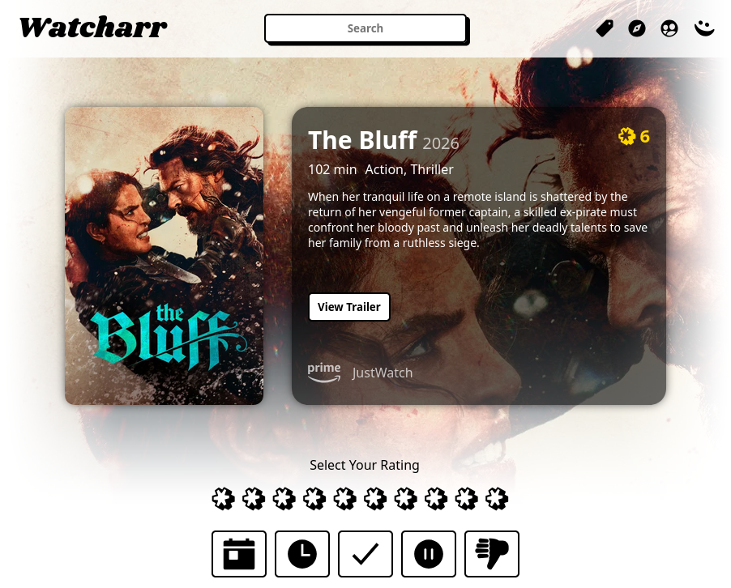

## Deprecations

If you have any questions about the deprecations, I'm reachable on Matrix (or you can open an issue/discussion; more info at the bottom of these release notes).

- `Include Previously Watched` setting no longer works for your main list and is due to be removed. The 'Last Finished' sort now acts as if this setting is set to 'true' (previously it defaulted to 'false').
- The `AddWatched` api is now also used for Games (The separate `AddPlayed` api was removed).
- The `AddWatched` api now accepts a `tmdbId` for movies/tv OR an `igdbId` for games.
  - It still supports the old `contentId` field to ensure any custom scripts out there still work, but in one of the future releases, this will be removed. You will see a warning in your logs if you are still using this property.
- All search endpoints have been replaced with a new central search endpoint that encompasses all behavior from the last endpoints.

## New

- Redesigned the top half of content pages.
- Redesigned people pages.
  - Added expandable biography (we are no longer limited to the first paragraph).
  - Added `age`.
- Your watched list is now delivered with pagination and infinite loading.
  - Gets you to your data quicker.
  - Reduces bandwidth usage.
  - Sorting and filtering is now done server-side (saving your device).
- Created a new centralized Search service.
  - Search by (external) id now occurs on server.
- Search: Support searching your own watched list for results before needing to go out to external db.
- import: You can now provide your own api key when doing a Trakt import (incase our included api key ever stops working).
- Games: Added providers (currently just: `Steam`, `GOG` & `itch.io`)
- Discover: Overhauled the entire experience.
  - Added games and people types.
  - Added sorting options.
  - Now with pagination so you can keep browsing past the top results for each media type and sort.
- Nav: The main search bar is now truly centered on the page and no longer jumps around when navigating through different pages.
- Added version log to server (with nice art if you are looking at cli output).

## Changed

- Games now use the normal `Poster` component (`GamePoster` has been deleted).
- Game results now loads max 40 records at once (previously was 10).
- Restyled the Error component that is shown when data fails to load for pages.

## Fixed

- Removed spammed duplicate styling being added to built styles (reducing wasted bandwidth on duplicate styling).
- Trakt importing.
- Replaced some `log.Fatal`s with real error responses.
- Improve twitch config by not writing empty time.

## Documentation

- Importing/Trakt: New section for optional api key field.
- Update screenshots to match new UI and add a person page screenshot.

## Maintenence

- Watcharr is now licensed under GPLv3!
- Server code has been completely redesigned/restructured.
- Created Makefiles for server/client.
  - For usual dev commands.
  - Added a nice `version` job for updating app version.
- Created a [FEATURES.md](/FEATURES.md).
- Upgrade to go 1.25.
- Dockerfile: Fix COPY requiring trailing slash on dest dir.
- Upgrade all doc site dependencies.

## A Note

I hope you all enjoy this release. Please feel free to provide any feedback and report any bugs you find!

## Etc

**Package**: https://github.com/sbondCo/Watcharr/pkgs/container/watcharr/716738135?tag=v3.0.0 or on [docker hub](https://hub.docker.com/layers/sbondco/watcharr/v3.0.0/images/sha256-1caeaec2dd8262864684e5b5156d230fc159102fccdcd150c46277b906a35f46).

# [2.1.1] - 2025-07-15

## Fixed

- import: Perfect matching now takes Year into account if provided by [@IRHM] in https://github.com/sbondCo/Watcharr/pull/915
- StarRating: Ignore star presses if scroll position changes from start to end of click (this should fix accidental rating changes when trying to scroll down the page on mobile) by [@IRHM] in https://github.com/sbondCo/Watcharr/pull/916
- Fix Twitch init error logging bug by [@ParksideParade] in https://github.com/sbondCo/Watcharr/pull/921
- fix bug on return from blurhash.Encode by [@ParksideParade] in https://github.com/sbondCo/Watcharr/pull/922

## Credits

Many thanks to everyone who has worked on this release!

- [@ParksideParade] made their first contribution in https://github.com/sbondCo/Watcharr/pull/921

## Etc

**Package**: https://github.com/orgs/sbondCo/packages/container/watcharr/462309867?tag=v2.1.1 or on [docker hub](https://hub.docker.com/layers/sbondco/watcharr/v2.1.1/images/sha256-8a94e8c5b718e61c073117b6eaef24095b326e94a9114bf56fe10ad0f0ae959e).

# [2.1.0] - 2025-05-18

## New

- About modal (accessible via face menu) by [@Clusters] in https://github.com/sbondCo/Watcharr/pull/811
- System app theme (automatically swaps between light/dark themes depending on system config) by [@antoniosarro] in https://github.com/sbondCo/Watcharr/pull/822
- Search shortcut (`Ctrl+S`) by [@IRHM] in https://github.com/sbondCo/Watcharr/pull/886

## Fixed

- Improve imdb import accuracy by [@jigglycrumb] in https://github.com/sbondCo/Watcharr/pull/880
- Support for importing ryot 8 files by [@IvanBeke] in https://github.com/sbondCo/Watcharr/pull/862
- Search: add missing keys that search handler should ignore by [@IRHM] in https://github.com/sbondCo/Watcharr/pull/886

## Maintenance

- server: bump github.com/gin-contrib/cors from 1.7.3 to 1.7.5 in /server by @dependabot in https://github.com/sbondCo/Watcharr/pull/864
- server: bump golang.org/x/crypto from 0.32.0 to 0.37.0 in /server by @dependabot in https://github.com/sbondCo/Watcharr/pull/863
- server: bump github.com/golang-jwt/jwt/v5 from 5.2.1 to 5.2.2 in /server by @dependabot in https://github.com/sbondCo/Watcharr/pull/846
- server: bump github.com/go-co-op/gocron/v2 from 2.14.2 to 2.16.1 in /server by @dependabot in https://github.com/sbondCo/Watcharr/pull/842
- ui: bump @sveltejs/kit from 2.16.0 to 2.20.6 by @dependabot in https://github.com/sbondCo/Watcharr/pull/875
- ui: bump vite from 6.0.7 to 6.2.6 by @dependabot in https://github.com/sbondCo/Watcharr/pull/873
- ui: bump axios from 1.7.9 to 1.8.4 by @dependabot in https://github.com/sbondCo/Watcharr/pull/855
- ui: bump prettier-plugin-svelte from 3.3.2 to 3.3.3 by @dependabot in https://github.com/sbondCo/Watcharr/pull/773
- ui: bump @typescript-eslint/eslint-plugin from 8.19.0 to 8.30.1 by @dependabot in https://github.com/sbondCo/Watcharr/pull/874
- ui: bump sass from 1.83.0 to 1.86.3 by @dependabot in https://github.com/sbondCo/Watcharr/pull/867
- ui: bump eslint-config-prettier from 9.1.0 to 10.1.2 by @dependabot in https://github.com/sbondCo/Watcharr/pull/872
- ui: bump typescript from 5.7.2 to 5.8.3 by @dependabot in https://github.com/sbondCo/Watcharr/pull/865

## Documentation

- doc: Add text-file, trakt, watcharr pages for importing. by [@IRHM] in https://github.com/sbondCo/Watcharr/pull/883

## Credits

Many thanks to everyone who has worked on this release!

- [@Clusters] made their first contribution in https://github.com/sbondCo/Watcharr/pull/811
- [@jigglycrumb] made their first contribution in https://github.com/sbondCo/Watcharr/pull/880
- [@IvanBeke] made their first contribution in https://github.com/sbondCo/Watcharr/pull/862

## The Future

v3.0 has been in-progress for a while now. A rework of how list data is handled is coming soon. Nothing but better performance should be noticed by you (as usual, there will be zero breaking changes so don't worry about migrations). When v3.0 is released, we will get back to more regular feature releases.

## Etc

**Package**: https://github.com/orgs/sbondCo/packages/container/watcharr/418145464?tag=v2.1.0 or on [docker hub](https://hub.docker.com/layers/sbondco/watcharr/v2.1.0/images/sha256-09f4dbc21aa67b689516357fb51718470dc2c0985bcc272c34d5cd94c5ef9cc7).

# [2.0.2] - 2025-02-16

## Fixed

- DetailedMenu: Fix state not properly being saved (and as a result, wlDetailView not being updated in localStorage, causing the setting to reset after a page refresh) by [@IRHM] in https://github.com/sbondCo/Watcharr/pull/814

## Etc

**Package**: https://github.com/sbondCo/Watcharr/pkgs/container/watcharr/356688609?tag=v2.0.2 or [on docker hub](https://hub.docker.com/layers/sbondco/watcharr/v2.0.2/images/sha256-1e82b2c173ff035e6f333485a5526a3670c5dfd27b9e163ffac12893d7f4469a)

# [2.0.1] - 2025-02-14

## New

- Search by IGDB ID & TMDB ID support by [@IRHM] in https://github.com/sbondCo/Watcharr/pull/807
- SeasonsList: Added season status and episode count to entries by [@antoniosarro] in https://github.com/sbondCo/Watcharr/pull/784
  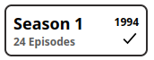
- SeasonsList: Horizontal scroller for mobile view by [@IRHM] in https://github.com/sbondCo/Watcharr/pull/808
  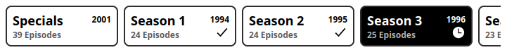

## Fixed

- Game: Fix search when query contains special character (space, etc) by [@IRHM] in https://github.com/sbondCo/Watcharr/pull/806

## New Contributors

- [@antoniosarro] made their first contribution in https://github.com/sbondCo/Watcharr/pull/784

## Etc

**Package**: https://github.com/sbondCo/Watcharr/pkgs/container/watcharr/355568229?tag=v2.0.1 or [on docker hub](https://hub.docker.com/layers/sbondco/watcharr/v2.0.1/images/sha256-6faa2ffe0d1a96921d7c6f17ada5bd005cf83ea5776bf23c39b82c434a3a20fd)

# [2.0.0] - 2025-01-23

> [!NOTE]  
> The next release is finally here! Don't worry about the major version bump though, there's nothing for you to do, other than update your server as usual ([more details here](https://github.com/sbondCo/Watcharr/discussions/768)).
>
> It is still recommended that you perform a backup before updating!

## New

- Trusted header authentication by [@lufixSch] & [@IRHM] in https://github.com/sbondCo/Watcharr/pull/736
- Person: Ability to sort items in people view by [@AlexPerathoner] in https://github.com/sbondCo/Watcharr/pull/670
- Person: 'On my list' filter support by [@AlexPerathoner] & [@IRHM] in https://github.com/sbondCo/Watcharr/pull/704
- Person: show message when no credits to show by [@IRHM] in https://github.com/sbondCo/Watcharr/pull/705
- Search by external id (with this format: `provider:id`, example: `imdb:tt15435876`) by [@IRHM] in https://github.com/sbondCo/Watcharr/pull/709
  - imdb (aliases: `i`, `imd`)
  - tvdb (aliases: `thetvdb`)
  - youtube (aliases: `yt`)
  - wikidata (aliases: `wd`, `wdt`)
  - facebook
  - instagram
  - twitter
  - tiktok
- Search: Support special characters (technically breaking, but only for frontend url, not api) by [@IRHM] in https://github.com/sbondCo/Watcharr/pull/713
- Imdb import (for movies & tv) by [@IRHM] in https://github.com/sbondCo/Watcharr/pull/726
- Imdb episodes import support (only if show is imported too from list) by [@IRHM] in https://github.com/sbondCo/Watcharr/pull/728
- Create a default error page by [@IRHM] in https://github.com/sbondCo/Watcharr/pull/738
- manage_users: Support swapping users between Watcharr/Proxy user types (which enabled a migration path for existing users over to becoming a trusted header user) by [@IRHM] in https://github.com/sbondCo/Watcharr/pull/747

## Changed

- Migration to Svelte 5, new code format rules for frontend, some general overdue refactoring by [@IRHM] in https://github.com/sbondCo/Watcharr/pull/762
  - Full migration to Svelte 5 (instead of slowly migrating, everything has been moved over to use Svelte 5 features now)
    - The store is now an object using the $state rune, instead of using a svelte store. All uses have been updated, looks a lot cleaner now!
  - Edited prettierrc: Use default `printWidth` of 80, Always leave trailing `,`, use tabs.
  - All code reformatted to use Tabs instead of Spaces (have been meaning to fix this for a while, all the code being changed in this pr was a good excuse to get it done).
  - Code makeover: A lot of stuff has been refactored to be (more) pleasing to the eyes.

## Fixed

- import: Disable 'change statuses' button while importing by [@IRHM] in https://github.com/sbondCo/Watcharr/pull/727
- Fix search debounce and styling by [@IRHM] in https://github.com/sbondCo/Watcharr/pull/770
- Fix importing state error by [@IRHM] in https://github.com/sbondCo/Watcharr/pull/781

## Documentation

- New screenshots for readme/doc site by [@IRHM] in https://github.com/sbondCo/Watcharr/pull/771

## Maintenance

- ui: bump @sveltejs/kit from 2.5.27 to 2.15.1 by @dependabot in https://github.com/sbondCo/Watcharr/pull/737
- ui: bump @typescript-eslint/eslint-plugin from 7.14.1 to 8.18.2 by @dependabot in https://github.com/sbondCo/Watcharr/pull/733
- ui: bump typescript from 5.5.4 to 5.7.2 by @dependabot in https://github.com/sbondCo/Watcharr/pull/703
- ui: bump @vite-pwa/sveltekit from 0.5.0 to 0.6.6 by @dependabot in https://github.com/sbondCo/Watcharr/pull/669
- ui: bump prettier from 3.3.2 to 3.4.2 by @dependabot in https://github.com/sbondCo/Watcharr/pull/714
- server: bump github.com/go-co-op/gocron/v2 from 2.11.0 to 2.14.0 in /server by @dependabot in https://github.com/sbondCo/Watcharr/pull/731
- server: bump gorm.io/driver/sqlite from 1.5.6 to 1.5.7 in /server by @dependabot in https://github.com/sbondCo/Watcharr/pull/723
- server: bump golang.org/x/crypto from 0.27.0 to 0.31.0 in /server by @dependabot in https://github.com/sbondCo/Watcharr/pull/717
- ui: bump @types/papaparse from 5.3.14 to 5.3.15 by @dependabot in https://github.com/sbondCo/Watcharr/pull/742
- server: bump github.com/gin-contrib/cors from 1.7.2 to 1.7.3 in /server by @dependabot in https://github.com/sbondCo/Watcharr/pull/745
- server: bump golang.org/x/crypto from 0.31.0 to 0.32.0 in /server by @dependabot in https://github.com/sbondCo/Watcharr/pull/748
- server: bump github.com/gin-contrib/cache from 1.3.0 to 1.3.1 in /server by @dependabot in https://github.com/sbondCo/Watcharr/pull/746
- server: bump github.com/go-co-op/gocron/v2 from 2.14.0 to 2.14.2 in /server by @dependabot in https://github.com/sbondCo/Watcharr/pull/761
- ui: bump @sveltejs/adapter-node from 5.2.11 to 5.2.12 by @dependabot in https://github.com/sbondCo/Watcharr/pull/763
- ui: bump @sveltejs/kit from 2.15.1 to 2.16.0 by @dependabot in https://github.com/sbondCo/Watcharr/pull/764

## Thanks

- [@lufixSch] For getting the base work done for the trusted header authentication support.
- [@christaikobo] For providing valuable feedback on trusted header authentication implementation.
- [@AlexPerathoner] For continued work on improving quality of life for the frontend.

## Etc

**Package**: https://github.com/sbondCo/Watcharr/pkgs/container/watcharr/342565711?tag=v2.0.0 or [on docker hub](https://hub.docker.com/layers/sbondco/watcharr/v2.0.0/images/sha256-efaf2f5aed5e6e0ef86f0e981f5c76949147d19fb2f4c28467eb55bf6df4e079)

# [1.44.2] - 2024-10-15

## Fixed

- GamePoster: Fix focus lost issue on rating/status via quick btns by [@IRHM] in https://github.com/sbondCo/Watcharr/pull/659
- Import: Ryot: Fix dates not importing for watched episodes by [@IRHM] in https://github.com/sbondCo/Watcharr/pull/664

## Thanks

- [@SirMartin] for reporting the Ryot import issue in #663

## Etc

**Package**: https://github.com/sbondCo/Watcharr/pkgs/container/watcharr/289810676?tag=v1.44.2 or [on docker hub](https://hub.docker.com/layers/sbondco/watcharr/v1.44.2/images/sha256-85df9a7f4e7cb73d89edf546c9458a096d40d2641c22e36d6ad41aa15da47625?context=explore)
**Full Changelog**: https://github.com/sbondCo/Watcharr/compare/

# [1.44.1] - 2024-10-13

## Fixed

- Fix PosterRating `minimal` option (previously stopped the popup from showing when used in the Seasons List and its Episode Items) by [@IRHM] in https://github.com/sbondCo/Watcharr/pull/655
- Poster: Fix focus lost after giving status/rating via quick btns by [@IRHM] in https://github.com/sbondCo/Watcharr/pull/657
- Improve download file func - don't make empty files, add extra logging by [@IRHM] in https://github.com/sbondCo/Watcharr/pull/658

## Maintenance

- Created a [security policy](https://github.com/sbondCo/Watcharr/blob/dev/SECURITY.md) for the repository.

## Thanks

- [@senz] for reporting the PosterRating issue in #654

## Etc

**Package**: https://github.com/sbondCo/Watcharr/pkgs/container/watcharr/288447184?tag=v1.44.1 or [on docker hub](https://hub.docker.com/layers/sbondco/watcharr/v1.44.1/images/sha256-90c2c58cd0d2d74ada7eaaf0350fb7c928b0d89f0031dc1c93a0bae653fcbe8c?context=explore)

# [1.44.0] - 2024-10-06

**IMPORTANT: This release contains security fixes, please make sure you upgrade!** Thanks to [@yamerooo123] for reporting the issues to me.

## New

- New rating systems (with better keyboard accessibility) by [@IRHM] in https://github.com/sbondCo/Watcharr/pull/627
  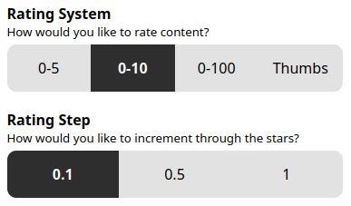
  
- Import: add todomovies by [@AlexPerathoner] in https://github.com/sbondCo/Watcharr/pull/618
- test-pr.yml: Add format_check_go job by [@IRHM] in https://github.com/sbondCo/Watcharr/pull/634

## Fixed

- Fix no filtering tag page and other stuffs i found by [@IRHM] in https://github.com/sbondCo/Watcharr/pull/633
- Fix tagmenu going out of bounds by [@IRHM] in https://github.com/sbondCo/Watcharr/pull/636
- Fix poster focus/accessibility issues and middle clicking by [@IRHM] in https://github.com/sbondCo/Watcharr/pull/647
- Fix poster summary overflowing by [@IRHM] in https://github.com/sbondCo/Watcharr/pull/648

## Maintenance

- ui: bump svelte from 4.2.17 to 4.2.19 by @dependabot in https://github.com/sbondCo/Watcharr/pull/611
- ui: bump vite from 5.2.11 to 5.4.6 by @dependabot in https://github.com/sbondCo/Watcharr/pull/631
- ui: bump @sveltejs/kit from 2.5.24 to 2.5.27 by @dependabot in https://github.com/sbondCo/Watcharr/pull/629
- server: bump gorm.io/gorm from 1.25.11 to 1.25.12 in /server by @dependabot in https://github.com/sbondCo/Watcharr/pull/623
- ui: bump @sveltejs/adapter-node from 5.0.1 to 5.2.3 by @dependabot in https://github.com/sbondCo/Watcharr/pull/635
- server: bump golang.org/x/crypto from 0.26.0 to 0.27.0 in /server by @dependabot in https://github.com/sbondCo/Watcharr/pull/624
- ui: bump svelte-check from 3.8.6 to 4.0.2 by @dependabot in https://github.com/sbondCo/Watcharr/pull/628
- ui: bump prettier-plugin-svelte from 3.2.3 to 3.2.6 by @dependabot in https://github.com/sbondCo/Watcharr/pull/616

## New Contributors

- [@AlexPerathoner] made their first contribution in https://github.com/sbondCo/Watcharr/pull/618

## Etc

**Package**: https://github.com/sbondCo/Watcharr/pkgs/container/watcharr/284866355?tag=v1.44.0 or on [docker hub](https://hub.docker.com/layers/sbondco/watcharr/v1.44.0/images/sha256-0ef8377d2bb68fe6f793ab9c994cc097b20582f646d29311db98aae2ab11a63d?context=explore).

# [1.43.0] - 2024-08-30

## New

- Page titles for browser tabs (profile, content, person) by [@IRHM] in https://github.com/sbondCo/Watcharr/pull/607
- Preload last season viewed by [@IRHM] in https://github.com/sbondCo/Watcharr/pull/609

## Fixed

- person: Fix credits not changing if nav between two people by [@IRHM] in https://github.com/sbondCo/Watcharr/pull/608

## 🔨 Maintenance

- ui: bump svelte-eslint-parser from 0.39.2 to 0.41.0 by @dependabot in https://github.com/sbondCo/Watcharr/pull/606
- ui: bump eslint-plugin-svelte from 2.41.0 to 2.43.0 by @dependabot in https://github.com/sbondCo/Watcharr/pull/603
- ui: bump tslib from 2.6.2 to 2.7.0 by @dependabot in https://github.com/sbondCo/Watcharr/pull/605
- ui: bump svelte-check from 3.8.5 to 3.8.6 by @dependabot in https://github.com/sbondCo/Watcharr/pull/604

## Etc

**Package**: https://github.com/sbondCo/Watcharr/pkgs/container/watcharr/265758944?tag=v1.43.0 or [on docker hub](https://hub.docker.com/layers/sbondco/watcharr/v1.43.0/images/sha256-fe0735de2ce51920560e559145945a214b000c91687682aa95c6b73b2dcb4a3b?context=explore)

# [1.42.0] - 2024-08-25

## New

- Trakt import support by [@IRHM] in https://github.com/sbondCo/Watcharr/pull/582
- Tags (you can now attach custom made tags to content in your main list) by [@IRHM] in https://github.com/sbondCo/Watcharr/pull/597
- job: support adding unique jobs (by name) by [@IRHM] in https://github.com/sbondCo/Watcharr/pull/583

## Changed

- Close all sub menus on nav bar after a navigation by [@IRHM] in https://github.com/sbondCo/Watcharr/pull/598
- api: Use `location` to create `baseURL` var in dev mode by [@IRHM] in https://github.com/sbondCo/Watcharr/pull/599

## Fixed

- Fixed unit oversight ('m' -> 'min' for episodes) by @oPisiti in https://github.com/sbondCo/Watcharr/pull/578

## 📖 [Documentation](https://watcharr.app/)

- doc: Create backup guide by [@IRHM] in https://github.com/sbondCo/Watcharr/pull/573

## 🔨 Maintenance

- ui: bump @sveltejs/kit from 2.5.10 to 2.5.24 by @dependabot in https://github.com/sbondCo/Watcharr/pull/596
- server: bump golang.org/x/crypto from 0.24.0 to 0.26.0 in /server by @dependabot in https://github.com/sbondCo/Watcharr/pull/593
- ui: bump axios from 1.7.2 to 1.7.4 by @dependabot in https://github.com/sbondCo/Watcharr/pull/600
- ui: bump svelte-check from 3.7.1 to 3.8.5 by @dependabot in https://github.com/sbondCo/Watcharr/pull/590
- ui: bump typescript from 5.4.5 to 5.5.4 by @dependabot in https://github.com/sbondCo/Watcharr/pull/588
- ui: bump svelte-preprocess from 5.1.4 to 6.0.2 by @dependabot in https://github.com/sbondCo/Watcharr/pull/586
- server: bump gorm.io/gorm from 1.25.10 to 1.25.11 in /server by @dependabot in https://github.com/sbondCo/Watcharr/pull/584
- server: bump github.com/go-co-op/gocron/v2 from 2.7.0 to 2.11.0 in /server by @dependabot in https://github.com/sbondCo/Watcharr/pull/587

## Etc

**Package**: https://github.com/orgs/sbondCo/packages/container/watcharr/263151699?tag=v1.42.0 or [on docker hub](https://hub.docker.com/layers/sbondco/watcharr/v1.42.0/images/sha256-cfb51f589e568e889e97d4ba99754e27f5dd701afc8dc7f2ac59d1c351e8fdcb?context=explore)

# [1.41.0] - 2024-06-28

I spent a lot of time trying to make sure no bugs were introduced with the new search features, please don't hesitate to reach out if you think someone is not working as intended!

## 🧠 New

- Search: Infinite scrolling and serverside content type filters by [@IRHM] in https://github.com/sbondCo/Watcharr/pull/562
  - Search now supports scrolling through multiple pages of results, making it possible to find content that may have been hidden in the past.
  - The search filters (Movies, TV Shows, Games, People) have been reworked to filter through the server, this leads to better results and more of them.
  - Running search requests will now be cancelled if you navigate away from the page or if you change your search query (helps a lot on slower connections).
- Ryot import implementation by [@oPisiti] in https://github.com/sbondCo/Watcharr/pull/563

## 💯 Changed

- Time unit changes by [@oPisiti] in https://github.com/sbondCo/Watcharr/pull/563
  - Movie/show runtimes are now printed as `24 min` instead of `24m`
  - Time spent watching stats can now show `months, weeks, days, hours & minutes`, instead of just the previous `hours and minutes`.

## 🏗️ Fixed

- Fix server side rating validation for imports, watched episodes and watched seasons in https://github.com/sbondCo/Watcharr/commit/7888e0490f20dfd31cffa17d92e0d90506ca6882

## 🔨 Maintenance

- server: bump golang.org/x/crypto from 0.23.0 to 0.24.0 in /server by @dependabot in https://github.com/sbondCo/Watcharr/pull/539
- ui: bump prettier from 3.2.5 to 3.3.2 by @dependabot in https://github.com/sbondCo/Watcharr/pull/549
- server: bump gorm.io/driver/sqlite from 1.5.5 to 1.5.6 in /server by @dependabot in https://github.com/sbondCo/Watcharr/pull/546
- workflow: bump docker/build-push-action from 5 to 6 by @dependabot in https://github.com/sbondCo/Watcharr/pull/545
- ui: bump @typescript-eslint/eslint-plugin from 7.12.0 to 7.14.1 by @dependabot in https://github.com/sbondCo/Watcharr/pull/560
- ui: bump svelte-eslint-parser from 0.36.0 to 0.39.2 by @dependabot in https://github.com/sbondCo/Watcharr/pull/559
- ui: bump eslint-plugin-svelte from 2.39.0 to 2.41.0 by @dependabot in https://github.com/sbondCo/Watcharr/pull/558
- server: bump github.com/go-co-op/gocron/v2 from 2.5.0 to 2.7.0 in /server by @dependabot in https://github.com/sbondCo/Watcharr/pull/557

## 🥇 Credit

- Thanks to [@oPisiti] for making their first (and second) contribution in https://github.com/sbondCo/Watcharr/pull/563
- Thanks to [@simonbcn] for reporting an issue that led to the search improvements being made in https://github.com/sbondCo/Watcharr/issues/531

Package: https://github.com/orgs/sbondCo/packages/container/watcharr/236341139?tag=v1.41.0 or [on docker hub](https://hub.docker.com/layers/sbondco/watcharr/v1.41.0/images/sha256-2229366989b906418c17df5a54c0c6d378f6044f45c591bba81a6cdd25e30a96?context=explore)

# [1.40.0] - 2024-06-09

## 🧠 New

- Better tasks (tasks rewritten and now reschedulable) by [@IRHM] in https://github.com/sbondCo/Watcharr/pull/526
  
- Episode automations by [@IRHM] in https://github.com/sbondCo/Watcharr/pull/536
  
- `AutomateShowStatuses` setting by [@IRHM] in https://github.com/sbondCo/Watcharr/pull/537

## 🏗️ Fixed

- plex: Comment out ViewMode property from structs by [@IRHM] in https://github.com/sbondCo/Watcharr/pull/538
- Activity: Fix header font-family https://github.com/sbondCo/Watcharr/commit/22bdadc0db47181bb1ddb361a8a4bedb77b43543
- watched: WatchedStatus: Fix HOLD value https://github.com/sbondCo/Watcharr/commit/1a3c9e08805485e73775bb4049464675ab2d64fa

## 🔨 Maintenance

- server: bump golang.org/x/crypto from 0.22.0 to 0.23.0 in /server by @dependabot in https://github.com/sbondCo/Watcharr/pull/514
- server: bump github.com/gin-contrib/cors from 1.7.1 to 1.7.2 in /server by @dependabot in https://github.com/sbondCo/Watcharr/pull/513
- server: bump gorm.io/gorm from 1.25.9 to 1.25.10 in /server by @dependabot in https://github.com/sbondCo/Watcharr/pull/505
- ui: bump svelte from 4.2.12 to 4.2.15 by @dependabot in https://github.com/sbondCo/Watcharr/pull/501
- ui: bump @typescript-eslint/eslint-plugin from 7.4.0 to 7.8.0 by @dependabot in https://github.com/sbondCo/Watcharr/pull/507
- ui: bump prettier-plugin-svelte from 3.2.2 to 3.2.3 by @dependabot in https://github.com/sbondCo/Watcharr/pull/483
- ui: bump @typescript-eslint/parser from 7.6.0 to 7.8.0 by @dependabot in https://github.com/sbondCo/Watcharr/pull/506
- ui: bump vite from 5.2.8 to 5.2.11 by @dependabot in https://github.com/sbondCo/Watcharr/pull/518
- ui: bump svelte-check from 3.6.9 to 3.7.1 by @dependabot in https://github.com/sbondCo/Watcharr/pull/525
- ui: bump svelte-preprocess from 5.1.3 to 5.1.4 by @dependabot in https://github.com/sbondCo/Watcharr/pull/519
- ui: bump @vite-pwa/sveltekit from 0.3.0 to 0.5.0 by @dependabot in https://github.com/sbondCo/Watcharr/pull/512
- ui: bump svelte-eslint-parser from 0.33.1 to 0.36.0 by @dependabot in https://github.com/sbondCo/Watcharr/pull/520
- server: bump github.com/gin-contrib/cache from 1.2.0 to 1.3.0 in /server by @dependabot in https://github.com/sbondCo/Watcharr/pull/522
- server: bump github.com/gin-gonic/gin from 1.9.1 to 1.10.0 in /server by @dependabot in https://github.com/sbondCo/Watcharr/pull/521
- ui: bump svelte from 4.2.15 to 4.2.17 by @dependabot in https://github.com/sbondCo/Watcharr/pull/527
- ui: bump axios from 1.6.8 to 1.7.2 by @dependabot in https://github.com/sbondCo/Watcharr/pull/533
- ui: bump @typescript-eslint/eslint-plugin from 7.8.0 to 7.12.0 by @dependabot in https://github.com/sbondCo/Watcharr/pull/534
- ui: bump @sveltejs/kit from 2.5.3 to 2.5.10 by @dependabot in https://github.com/sbondCo/Watcharr/pull/530
- ui: bump eslint-plugin-svelte from 2.35.1 to 2.39.0 by @dependabot in https://github.com/sbondCo/Watcharr/pull/529

## Etc

**Package**: https://github.com/orgs/sbondCo/packages/container/watcharr/227554693?tag=v1.40.0 or [on docker hub](https://hub.docker.com/layers/sbondco/watcharr/v1.40.0/images/sha256-de6b16f6cf7a5aa5a0e953c4fc1cc506e5b2a74a5c51292edf4c067b690152d1?context=explore)

# [1.39.0] - 2024-04-23

## 🧠 New

- Support pinning watched list items to the top of your list (pinned items are highlighted with a gold outline) by [@IRHM] in https://github.com/sbondCo/Watcharr/pull/498
  
- Support emby branding (new `USE_EMBY` setting that will swap out Jellyfin branding for Embys branding, no auth logic has been changed) by [@IRHM] in https://github.com/sbondCo/Watcharr/pull/504

## 💯 Changed

- Better thoughts (now a modal is opened so you can add your thoughts more easily) by [@IRHM] in https://github.com/sbondCo/Watcharr/pull/495
- Improve search (add content type filters and remove dumb sort) by [@IRHM] in https://github.com/sbondCo/Watcharr/pull/496
  
- Support detailed view for posters on search page by [@IRHM] in https://github.com/sbondCo/Watcharr/pull/497

## 🏗️ Fixed

- LastFinished Sort: Prefer custom dates that are set on `FINISHED` activities by [@IRHM] in https://github.com/sbondCo/Watcharr/pull/494
- Content Pages: Make btns container wrap elements when overflowing by [@IRHM] in https://github.com/sbondCo/Watcharr/pull/499

## 🥇 Credit

A big thanks to [@n00b12345], [@simonbcn], [@mommyune], [@gardebreak] and [@rguinn829] for suggesting the improvements/fixes made in this release!

## Etc

**Package**: https://github.com/orgs/sbondCo/packages/container/watcharr/207084376?tag=v1.39.0 or [on docker hub](https://hub.docker.com/layers/sbondco/watcharr/v1.39.0/images/sha256-9c5d999d92d3475b6a91317727d1620f14b5d85309a3878604f38c60eee22526?context=explore)

# [1.38.2] - 2024-04-18

## 🐞 Fixed

- container-release: Fix ghcr `latest` tag by [@IRHM] in b8003691651ac095e111d85266362f46a1a6036e

## 📖 [Documentation](https://watcharr.app/)

- docs: Remove `version` property in docker compose examples by [@IRHM] in b749bffa1585c2d2d3453e35c58d431ae2d9c118

## Credit

- Thanks to [@simonbcn] for reporting the issues fixed in this release!

## Etc

**Package**: https://github.com/orgs/sbondCo/packages/container/watcharr/205468961?tag=v1.38.2 or [on docker hub](https://hub.docker.com/layers/sbondco/watcharr/v1.38.2/images/sha256-a30d605acd154d5e346e5ae768cda5df1bbe6f21fac12f90765f3d1c67c57f6e?context=explore)

# [1.38.1] - 2024-04-18

## 🐞 Fixed

- Sorting by 'Last Watched' on public lists (by fetching Activity on public watched lists).
- Catch errors when filtering/sorting a list. Display a pretty error on screen when one occurs.

## Etc

**Package**: https://github.com/orgs/sbondCo/packages/container/watcharr/205195625?tag=v1.38.1 or [on docker hub](https://hub.docker.com/layers/sbondco/watcharr/v1.38.1/images/sha256-00a359e97aea939ace762030a0cbf40d796bb3db662ed822cddcf622b0f71391?context=explore)

# [1.38.0] - 2024-04-18

## 🧠 New

- Sonarr/Radarr request management, progress reporting and new auto approve permission by [@IRHM] in https://github.com/sbondCo/Watcharr/pull/474
  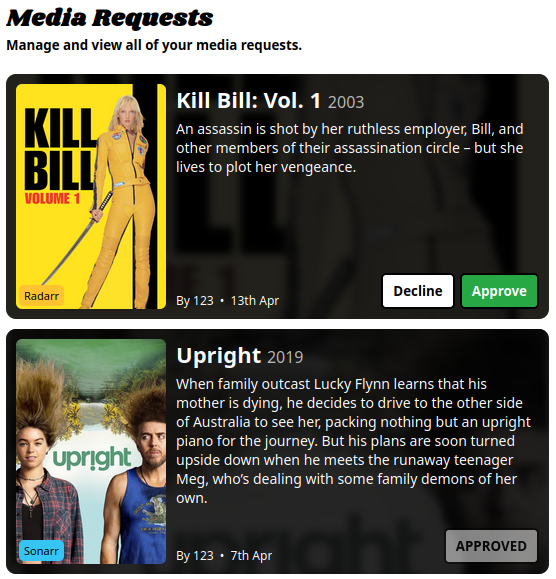
- Ability to set a country for correct streaming providers (doesn't affect language) by [@stignarnia] in https://github.com/sbondCo/Watcharr/pull/463
- Sort by last finished/played by [@IRHM] in https://github.com/sbondCo/Watcharr/pull/479
- Add delete button to content pages by [@IRHM] in https://github.com/sbondCo/Watcharr/pull/486

## 💯 Changed

- ProvidersList: Also display free providers by [@IRHM] in https://github.com/sbondCo/Watcharr/pull/478

## 🧼 Fixed

- import: Fix customDates all coming back the same in all activity when importing a watcharr export by [@IRHM] in https://github.com/sbondCo/Watcharr/pull/485
- Games: Fix not being able to add games previously removed from list by [@IRHM] in https://github.com/sbondCo/Watcharr/pull/487

## 📖 [Documentation](https://watcharr.app/)

- docs: Environment Variables by [@IRHM] in https://github.com/sbondCo/Watcharr/pull/445

## 🔨 Maintenance

- server: bump gorm.io/gorm from 1.25.7 to 1.25.9 in /server by @dependabot in https://github.com/sbondCo/Watcharr/pull/449
- server: bump github.com/gin-contrib/cors from 1.7.0 to 1.7.1 in /server by @dependabot in https://github.com/sbondCo/Watcharr/pull/435
- ui: bump svelte from 4.2.10 to 4.2.12 by @dependabot in https://github.com/sbondCo/Watcharr/pull/421
- ui: bump axios from 1.6.7 to 1.6.8 by @dependabot in https://github.com/sbondCo/Watcharr/pull/418
- ui: bump prettier-plugin-svelte from 3.2.1 to 3.2.2 by @dependabot in https://github.com/sbondCo/Watcharr/pull/417
- ui: bump @sveltejs/adapter-node from 4.0.1 to 5.0.1 by @dependabot in https://github.com/sbondCo/Watcharr/pull/419
- ui: bump @typescript-eslint/eslint-plugin from 7.2.0 to 7.4.0 by @dependabot in https://github.com/sbondCo/Watcharr/pull/434
- ui: bump vite from 5.1.6 to 5.2.8 by @dependabot in https://github.com/sbondCo/Watcharr/pull/469
- ui: bump typescript from 5.3.3 to 5.4.5 by @dependabot in https://github.com/sbondCo/Watcharr/pull/475
- ui: bump svelte-check from 3.6.4 to 3.6.9 by @dependabot in https://github.com/sbondCo/Watcharr/pull/467
- ui: bump @typescript-eslint/parser from 7.2.0 to 7.6.0 by @dependabot in https://github.com/sbondCo/Watcharr/pull/466
- workflow: bump peaceiris/actions-gh-pages from 3 to 4 by @dependabot in https://github.com/sbondCo/Watcharr/pull/465
- server: bump golang.org/x/crypto from 0.21.0 to 0.22.0 in /server by @dependabot in https://github.com/sbondCo/Watcharr/pull/470

## New Contributors

- [@stignarnia] made their first contribution (thank you very much!) in https://github.com/sbondCo/Watcharr/pull/463

## Etc

**Package**: https://github.com/orgs/sbondCo/packages/container/watcharr/205183324?tag=v1.38.0 or [on docker hub](https://hub.docker.com/layers/sbondco/watcharr/v1.38.0/images/sha256-736623c87bdf8b12660fc9e42c1cbf8d4bd5f85d15c9b087d5c443e412ec5665?context=explore)

# [1.37.0] - 2024-03-27

Some changes regarding responsiveness on mobile have been made (dynamic poster sizes at certain device sizes). I did my best to ensure nothing broke, but if you spot anything, please let us know!

## 🌔 New

- Configurable data location via environment variable `WATCHARR_DATA` by @mordquist in https://github.com/sbondCo/Watcharr/pull/423
- User management by [@IRHM] in https://github.com/sbondCo/Watcharr/pull/437
  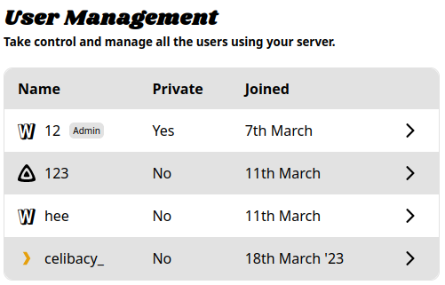
- Importing Watcharr Exports by @stephaje in https://github.com/sbondCo/Watcharr/pull/389
- Importing from MyAnimeList by [@IRHM] in https://github.com/sbondCo/Watcharr/pull/439

## ☎️ Changed

- Poster and search bar mobile responsiveness improvements by [@IRHM] in https://github.com/sbondCo/Watcharr/pull/428

## 📖 [Documentation](https://watcharr.app/)

- docs: installation for development by [@IRHM] in https://github.com/sbondCo/Watcharr/pull/432
- docs: restoring admin guide by [@IRHM] in https://github.com/sbondCo/Watcharr/pull/438
- docs: Importing from MyAnimeList by [@IRHM] in https://github.com/sbondCo/Watcharr/pull/439
- [ImgBot] Optimize images by @imgbot in https://github.com/sbondCo/Watcharr/pull/440

## ⛏️ New Contributors

- @mordquist made their first contribution (thank you very much for the great work!) in https://github.com/sbondCo/Watcharr/pull/423

## Etc

**Package**: https://github.com/orgs/sbondCo/packages/container/watcharr/196745444?tag=v1.37.0

# [1.36.0] - 2024-03-18

## 🌚 New

- Plex authentication by [@stephaje] in https://github.com/sbondCo/Watcharr/pull/387 and [@IRHM] in https://github.com/sbondCo/Watcharr/pull/402
- Plex sync by [@IRHM] and [@stephaje] in https://github.com/sbondCo/Watcharr/pull/413

## 🔧 Fixed

- Jobs: Fix getting job when id includes a slash (/) by [@IRHM] in https://github.com/sbondCo/Watcharr/pull/415

## ⛰️ Maintenance

- ui: bump vite from 5.1.3 to 5.1.6 by @dependabot in https://github.com/sbondCo/Watcharr/pull/408
- ui: bump @sveltejs/kit from 2.5.0 to 2.5.3 by @dependabot in https://github.com/sbondCo/Watcharr/pull/405
- ui: bump @typescript-eslint/parser from 7.0.2 to 7.2.0 by @dependabot in https://github.com/sbondCo/Watcharr/pull/406
- server: bump github.com/golang-jwt/jwt/v5 from 5.2.0 to 5.2.1 in /server by @dependabot in https://github.com/sbondCo/Watcharr/pull/404
- server: bump golang.org/x/crypto from 0.19.0 to 0.21.0 in /server by @dependabot in https://github.com/sbondCo/Watcharr/pull/393
- ui: bump eslint from 8.56.0 to 8.57.0 by @dependabot in https://github.com/sbondCo/Watcharr/pull/378
- server: bump github.com/gin-contrib/cors from 1.5.0 to 1.7.0 in /server by @dependabot in https://github.com/sbondCo/Watcharr/pull/403
- ui: bump @typescript-eslint/eslint-plugin from 7.0.2 to 7.2.0 by @dependabot in https://github.com/sbondCo/Watcharr/pull/407
- ui: bump follow-redirects from 1.15.4 to 1.15.6 by @dependabot in https://github.com/sbondCo/Watcharr/pull/412
- Bump follow-redirects from 1.15.5 to 1.15.6 in /doc by @dependabot in https://github.com/sbondCo/Watcharr/pull/414

## Etc

**Package**: https://github.com/orgs/sbondCo/packages/container/watcharr/192128255?tag=v1.36.0

# [1.35.2] - 2024-03-07

## Fixed

- `Registering Disabled` bug when setting up first user #400
  If you were affected by this bug, please remove your `watcharr.json` config file, update to this version and try again (alternatively, you could update your `watcharr.json` config and set `SIGNUP_ENABLED` to `true` then restart). Sorry for any inconvenience.

## 🥇 Credit

- Thanks to [@priyajit4u] for reporting the issue fixed in this release.

## Etc

**Package**: https://github.com/orgs/sbondCo/packages/container/watcharr/188028779?tag=v1.35.2

# [1.35.1] - 2024-03-06

## Fixed

- Don't omit `SIGNUP_ENABLED` from config when false (fixing it being re-enabled after a restart) by [@IRHM] in https://github.com/sbondCo/Watcharr/pull/399

## Documentation

- Add `restart` property to docker-compose example by [@IRHM] in https://github.com/sbondCo/Watcharr/pull/398

## 🥇 Credit

- Thanks to [@n00b12345] for suggesting/reporting the two changes made in this patch release.

## Etc

**Package**: https://github.com/orgs/sbondCo/packages/container/watcharr/187807718?tag=v1.35.1

# [1.35.0] - 2024-03-05

## New

- Editing activity time and (soft) deleting activity by [@stephaje] in https://github.com/sbondCo/Watcharr/pull/366
  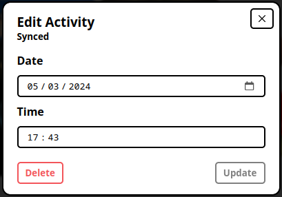
- Jellyfin (Manual) Sync (for jellyfin profile, triggered by button in profile page) by [@IRHM] in https://github.com/sbondCo/Watcharr/pull/394 & https://github.com/sbondCo/Watcharr/pull/395

## Maintenance

- ui: bump vite from 5.0.12 to 5.1.3 by @dependabot in https://github.com/sbondCo/Watcharr/pull/369
- ui: bump @typescript-eslint/eslint-plugin from 6.21.0 to 7.0.0 by @dependabot in https://github.com/sbondCo/Watcharr/pull/367
- ui: bump prettier-plugin-svelte from 3.1.2 to 3.2.1 by @dependabot in https://github.com/sbondCo/Watcharr/pull/368
- ui: bump svelte-check from 3.6.3 to 3.6.4 by @dependabot in https://github.com/sbondCo/Watcharr/pull/370

## New Contributors

- [@stephaje] made their first contribution (thanks a lot!) in https://github.com/sbondCo/Watcharr/pull/366

## Etc

**Package**: https://github.com/orgs/sbondCo/packages/container/watcharr/187219192?tag=v1.35.0

# [1.34.0] - 2024-02-18

## New

- Ratings and Statuses for episodes by [@IRHM] in https://github.com/sbondCo/Watcharr/pull/363

## Fixed

- Fix discovery (trending) requests by [@IRHM] in https://github.com/sbondCo/Watcharr/pull/365

## Maintenance

- [ImgBot] Optimize images by @imgbot in https://github.com/sbondCo/Watcharr/pull/357
- ui: bump axios from 1.6.5 to 1.6.7 by @dependabot in https://github.com/sbondCo/Watcharr/pull/339
- ui: bump svelte from 4.2.8 to 4.2.10 by @dependabot in https://github.com/sbondCo/Watcharr/pull/337
- ui: bump @typescript-eslint/eslint-plugin from 6.20.0 to 6.21.0 by @dependabot in https://github.com/sbondCo/Watcharr/pull/338
- ui: bump prettier from 3.2.4 to 3.2.5 by @dependabot in https://github.com/sbondCo/Watcharr/pull/341
- server: bump gorm.io/gorm from 1.25.6 to 1.25.7 in /server by @dependabot in https://github.com/sbondCo/Watcharr/pull/355
- server: bump golang.org/x/crypto from 0.18.0 to 0.19.0 in /server by @dependabot in https://github.com/sbondCo/Watcharr/pull/354
- server: bump gorm.io/driver/sqlite from 1.5.4 to 1.5.5 in /server by @dependabot in https://github.com/sbondCo/Watcharr/pull/353

## Etc

**Package**: https://github.com/sbondCo/Watcharr/pkgs/container/watcharr/180398221?tag=v1.34.0

# [1.33.0] - 2024-02-12

# 🔫 The Games Update

The changelog may be small, but we've all learned not to judge a book by it's cover, right?

## New

- Games Support in https://github.com/sbondCo/Watcharr/pull/342
- [Game docs](https://watcharr.app/docs/server_config/game-support-igdb) in https://github.com/sbondCo/Watcharr/pull/343

## Fixed

- Poster images flashing white, then staying white after hover in https://github.com/sbondCo/Watcharr/pull/342

## Etc

**Package**: https://github.com/orgs/sbondCo/packages/container/watcharr/177545525?tag=v1.33.0

# [1.32.1] - 2024-02-03

## 🔧 Fixed

- Save watchedAt date and keep watched movies that are also on watchlist when importing from Movary in https://github.com/sbondCo/Watcharr/pull/335
- Create 'Include Previously Watched' setting for showing previously watched content in 'Finished' filter in https://github.com/sbondCo/Watcharr/pull/335
  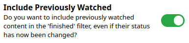
- Fix all 'dates watched' activity having same date after import in https://github.com/sbondCo/Watcharr/pull/336
- Include previously watched in profile stats in https://github.com/sbondCo/Watcharr/pull/336
- Fix finished filter not working with type filter in https://github.com/sbondCo/Watcharr/pull/336

## 🥇 Credit

- A big thanks to [@sahinakkaya] for helping test and finding the issues fixed in this release (and suggesting the features).

## Etc

**Package**: https://github.com/orgs/sbondCo/packages/container/watcharr/174461124?tag=v1.32.1

# [1.32.0] - 2024-02-02

## New

- Movary Importing by [@IRHM] (thanks to [@sahinakkaya]) in https://github.com/sbondCo/Watcharr/pull/334

## Changed

- Update content table on request by [@IRHM] in https://github.com/sbondCo/Watcharr/pull/314

## Maintenance

- ui: bump vite from 5.0.11 to 5.0.12 by @dependabot in https://github.com/sbondCo/Watcharr/pull/320
- ui: bump prettier from 3.1.1 to 3.2.4 by @dependabot in https://github.com/sbondCo/Watcharr/pull/322
- ui: bump @sveltejs/adapter-node from 2.0.2 to 4.0.1 by @dependabot in https://github.com/sbondCo/Watcharr/pull/331
- ui: bump @typescript-eslint/eslint-plugin from 6.18.0 to 6.20.0 by @dependabot in https://github.com/sbondCo/Watcharr/pull/330
- server: bump gorm.io/gorm from 1.25.5 to 1.25.6 in /server by @dependabot in https://github.com/sbondCo/Watcharr/pull/327
- ui: bump @typescript-eslint/parser from 6.18.0 to 6.20.0 by @dependabot in https://github.com/sbondCo/Watcharr/pull/328
- ui: bump svelte-check from 3.6.2 to 3.6.3 by @dependabot in https://github.com/sbondCo/Watcharr/pull/317

## Etc

**Package**: https://github.com/orgs/sbondCo/packages/container/watcharr/173982496?tag=v1.32.0

# [1.31.1] - 2024-01-09

## New

- Watchtime Profile Stat by [@IRHM] in https://github.com/sbondCo/Watcharr/pull/302
  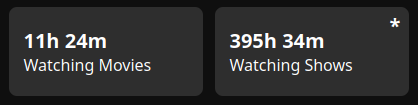
- Support ARM64 Arch by [@IRHM] (thanks to [@schmurian]) in https://github.com/sbondCo/Watcharr/pull/310

## Maintenance

- ui: bump vite from 5.0.10 to 5.0.11 by @dependabot in https://github.com/sbondCo/Watcharr/pull/307
- server: bump golang.org/x/crypto from 0.17.0 to 0.18.0 in /server by @dependabot in https://github.com/sbondCo/Watcharr/pull/303
- ui: bump @typescript-eslint/eslint-plugin from 6.17.0 to 6.18.0 by @dependabot in https://github.com/sbondCo/Watcharr/pull/306
- ui: bump @sveltejs/kit from 2.0.6 to 2.0.7 by @dependabot in https://github.com/sbondCo/Watcharr/pull/305
- ui: bump axios from 1.6.3 to 1.6.5 by @dependabot in https://github.com/sbondCo/Watcharr/pull/304
- ui: bump @sveltejs/kit from 2.0.7 to 2.0.8 by @dependabot in https://github.com/sbondCo/Watcharr/pull/308
- Bump follow-redirects from 1.15.3 to 1.15.4 in /doc by @dependabot in https://github.com/sbondCo/Watcharr/pull/311

## Etc

**Package**: https://github.com/orgs/sbondCo/packages/container/watcharr/165278865?tag=v1.31.1

# [1.31.0] - 2024-01-07

## New

- Poster detailed view by [@IRHM] (thanks to [@Contrillion-2]) in https://github.com/sbondCo/Watcharr/pull/297
  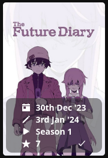 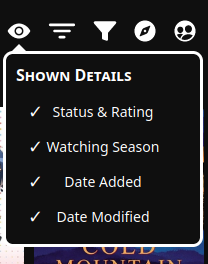

## Fixed

- Input changed validation by [@IRHM] in https://github.com/sbondCo/Watcharr/pull/299

## Maintenance

- ui: bump axios from 1.6.2 to 1.6.3 by @dependabot in https://github.com/sbondCo/Watcharr/pull/293
- ui: bump @typescript-eslint/eslint-plugin from 6.16.0 to 6.17.0 by @dependabot in https://github.com/sbondCo/Watcharr/pull/294
- ui: bump @typescript-eslint/parser from 6.16.0 to 6.18.0 by @dependabot in https://github.com/sbondCo/Watcharr/pull/298

## Etc

**Package**: https://github.com/orgs/sbondCo/packages/container/watcharr/164427545?tag=v1.31.0

# [1.30.0] - 2024-01-01

## New

- Change Password by [@iamericfletcher] in https://github.com/sbondCo/Watcharr/pull/290
- Export Watched List by [@IRHM] in https://github.com/sbondCo/Watcharr/pull/291

## Changed

- Content rating text follow hovered star by [@IRHM] in https://github.com/sbondCo/Watcharr/pull/292

## Etc

**Package**: https://github.com/orgs/sbondCo/packages/container/watcharr/162656150?tag=v1.30.0

# [1.29.0] - 2023-12-26

## New

- Enhancement: Allow filtering and sorting other watched lists #276 by [@iamericfletcher] in https://github.com/sbondCo/Watcharr/pull/281
- Public thoughts (view your followed users' reviews/thoughts on movie/tv pages and new setting to keep your thoughts private) by [@IRHM] in https://github.com/sbondCo/Watcharr/pull/288
  

## Fixed

- Fix tooltips on scroll and from causing overflow on window resize by [@IRHM] in https://github.com/sbondCo/Watcharr/pull/277
- Fix content with same tmdb ids by [@IRHM] in https://github.com/sbondCo/Watcharr/pull/280

## Maintenance

- [ImgBot] Optimize images by @imgbot in https://github.com/sbondCo/Watcharr/pull/268
- server: bump golang.org/x/crypto from 0.16.0 to 0.17.0 in /server by @dependabot in https://github.com/sbondCo/Watcharr/pull/275
- ui: bump @typescript-eslint/parser from 6.13.1 to 6.15.0 by @dependabot in https://github.com/sbondCo/Watcharr/pull/274
- workflow: bump actions/checkout from 3 to 4 by @dependabot in https://github.com/sbondCo/Watcharr/pull/272
- ui: bump typescript from 5.3.2 to 5.3.3 by @dependabot in https://github.com/sbondCo/Watcharr/pull/264
- workflow: bump actions/setup-node from 3 to 4 by @dependabot in https://github.com/sbondCo/Watcharr/pull/271
- ui: bump prettier-plugin-svelte from 3.0.3 to 3.1.2 by @dependabot in https://github.com/sbondCo/Watcharr/pull/262
- ui: bump eslint-plugin-svelte from 2.35.0 to 2.35.1 by @dependabot in https://github.com/sbondCo/Watcharr/pull/263
- ui: bump @sveltejs/kit from 1.27.6 to 2.0.6 by @dependabot in https://github.com/sbondCo/Watcharr/pull/278
- ui: bump prettier from 3.1.0 to 3.1.1 by @dependabot in https://github.com/sbondCo/Watcharr/pull/287
- ui: bump eslint from 8.55.0 to 8.56.0 by @dependabot in https://github.com/sbondCo/Watcharr/pull/286
- ui: bump svelte-preprocess from 5.1.1 to 5.1.3 by @dependabot in https://github.com/sbondCo/Watcharr/pull/283
- ui: bump @typescript-eslint/parser from 6.15.0 to 6.16.0 by @dependabot in https://github.com/sbondCo/Watcharr/pull/284
- ui: bump @typescript-eslint/eslint-plugin from 6.13.0 to 6.16.0 by @dependabot in https://github.com/sbondCo/Watcharr/pull/285

## New Contributors

- [@iamericfletcher] made their first contribution (thank you very much!) in https://github.com/sbondCo/Watcharr/pull/281

## Etc

**Package**: https://github.com/orgs/sbondCo/packages/container/watcharr/161474333?tag=v1.29.0

# [1.28.0] - 2023-12-10

## New

- PWA Support by [@ishaanparlikar] in https://github.com/sbondCo/Watcharr/pull/259
- Basic sort and filter indicators by [@IRHM] in https://github.com/sbondCo/Watcharr/pull/253
- Episode overview and runtime by [@IRHM] in https://github.com/sbondCo/Watcharr/pull/257

## Changed

- Hiding rating when hide spoiler is checked in profile by [@ishaanparlikar] in https://github.com/sbondCo/Watcharr/pull/255

## Fixed

- Fix tooltip and nav overflow by [@IRHM] in https://github.com/sbondCo/Watcharr/pull/254
- Fix dockerfile server build by [@IRHM] in https://github.com/sbondCo/Watcharr/pull/260

## Maintenance

- ui: bump @types/papaparse from 5.3.11 to 5.3.14 by @dependabot in https://github.com/sbondCo/Watcharr/pull/249
- ui: bump vite from 4.5.0 to 4.5.1 by @dependabot in https://github.com/sbondCo/Watcharr/pull/251
- ui: bump eslint from 8.54.0 to 8.55.0 by @dependabot in https://github.com/sbondCo/Watcharr/pull/250
- ui: bump svelte from 4.2.7 to 4.2.8 by @dependabot in https://github.com/sbondCo/Watcharr/pull/246
- server: bump github.com/golang-jwt/jwt/v5 from 5.1.0 to 5.2.0 in /server by @dependabot in https://github.com/sbondCo/Watcharr/pull/245
- ui: bump eslint-config-prettier from 9.0.0 to 9.1.0 by @dependabot in https://github.com/sbondCo/Watcharr/pull/248
- ui: bump svelte-preprocess from 5.1.0 to 5.1.1 by @dependabot in https://github.com/sbondCo/Watcharr/pull/247
- PR Template and test workflow by [@IRHM] in https://github.com/sbondCo/Watcharr/pull/266

## New Contributors

- [@ishaanparlikar] made their first contribution (thank you for taking the time!) in https://github.com/sbondCo/Watcharr/pull/255

## Etc

**Package**: https://github.com/orgs/sbondCo/packages/container/watcharr/156358524?tag=v1.28.0

# [1.27.0] - 2023-12-03

## New

- User configure (avatars and bios) by [@IRHM] in https://github.com/sbondCo/Watcharr/pull/242
  

## Changed

- Nav: Hide buttons when searchbar is focused by [@IRHM] in https://github.com/sbondCo/Watcharr/pull/241

## Fixed

- Posters - Use cached images on watched list by [@IRHM] in https://github.com/sbondCo/Watcharr/pull/243

## Maintenance

- ui: bump @typescript-eslint/eslint-plugin from 6.11.0 to 6.13.0 by @dependabot in https://github.com/sbondCo/Watcharr/pull/227
- ui: bump @typescript-eslint/parser from 6.11.0 to 6.13.1 by @dependabot in https://github.com/sbondCo/Watcharr/pull/240
- server: bump golang.org/x/crypto from 0.15.0 to 0.16.0 in /server by @dependabot in https://github.com/sbondCo/Watcharr/pull/233
- ui: bump svelte-check from 3.6.0 to 3.6.2 by @dependabot in https://github.com/sbondCo/Watcharr/pull/229
- ui: bump axios from 1.6.1 to 1.6.2 by @dependabot in https://github.com/sbondCo/Watcharr/pull/230
- ui: bump prettier from 3.0.3 to 3.1.0 by @dependabot in https://github.com/sbondCo/Watcharr/pull/231
- server: bump github.com/gin-contrib/cors from 1.4.0 to 1.5.0 in /server by @dependabot in https://github.com/sbondCo/Watcharr/pull/232

## Etc

**Package**: https://github.com/sbondCo/Watcharr/pkgs/container/watcharr/154020222?tag=v1.27.0

# [1.26.0] - 2023-11-28

## New

- Following Users by [@IRHM] in https://github.com/sbondCo/Watcharr/pull/234 (thanks @DNYLA)
  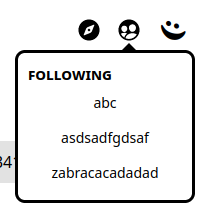
  Also: Users and content results separated and user list restyled:
  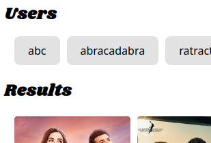

## Changed

- Movie default status to FINISHED by [@IRHM] in https://github.com/sbondCo/Watcharr/pull/239 (thanks @MathieuMoalic)

## Fixed

- User list posters (unrated text and buttons showing) by [@IRHM] in https://github.com/sbondCo/Watcharr/pull/234

## Etc

**Package**: https://github.com/orgs/sbondCo/packages/container/watcharr/151995542?tag=v1.26.0

# [1.25.0] - 2023-11-20

## New

- :star2: Import rating and rating date from TMDb, give activity customDate column by [@IRHM] in https://github.com/sbondCo/Watcharr/pull/223 (thanks [@MathieuMoalic])

## Maintenance

- ui: bump @sveltejs/kit from 1.27.5 to 1.27.6 by @dependabot in https://github.com/sbondCo/Watcharr/pull/222
- ui: bump eslint from 8.53.0 to 8.54.0 by @dependabot in https://github.com/sbondCo/Watcharr/pull/221
- ui: bump typescript from 5.2.2 to 5.3.2 by @dependabot in https://github.com/sbondCo/Watcharr/pull/220
- ui: bump svelte-check from 3.5.2 to 3.6.0 by @dependabot in https://github.com/sbondCo/Watcharr/pull/218
- ui: bump svelte from 4.2.3 to 4.2.7 by @dependabot in https://github.com/sbondCo/Watcharr/pull/219

## Etc

- **Package**: https://github.com/orgs/sbondCo/packages/container/watcharr/149697959?tag=v1.25.0

# [1.24.0] - 2023-11-19

## New

- TMDb Importing by [@MathieuMoalic] in https://github.com/sbondCo/Watcharr/pull/216

## Etc

- **Package**: https://github.com/orgs/sbondCo/packages/container/watcharr/149272531?tag=v1.24.0

# [1.23.0] - 2023-11-19

## New

- Admin stats by [@IRHM] in https://github.com/sbondCo/Watcharr/pull/213
  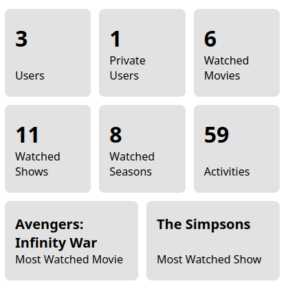

## Etc

- **Package**: https://github.com/orgs/sbondCo/packages/container/watcharr/149193730?tag=v1.23.0

# [1.22.0] - 2023-11-17

## New

- 📺 Sonarr Requesting (preview - enable in server settings) by [@IRHM] in https://github.com/sbondCo/Watcharr/pull/195
- 🎥 Radarr requesting (preview - enable in server settings) by [@IRHM] in https://github.com/sbondCo/Watcharr/pull/198

## Fixed

- 📦 Fix poster button colors in dark theme by [@IRHM] in https://github.com/sbondCo/Watcharr/pull/196
- 🔧 Fix left positioned tooltips and add tooltips to nav icons by [@IRHM] in https://github.com/sbondCo/Watcharr/pull/208
- 🧾 Hide request button when sonarr/radarr disabled by [@IRHM] in https://github.com/sbondCo/Watcharr/pull/210

## Changed

- 📖 readme: update and add new screenshots by [@IRHM] in https://github.com/sbondCo/Watcharr/pull/191

## Maintenance

- ui: bump eslint from 8.52.0 to 8.53.0 by @dependabot in https://github.com/sbondCo/Watcharr/pull/186
- ui: bump @typescript-eslint/parser from 6.9.1 to 6.10.0 by @dependabot in https://github.com/sbondCo/Watcharr/pull/187
- ui: bump @typescript-eslint/eslint-plugin from 6.9.1 to 6.10.0 by @dependabot in https://github.com/sbondCo/Watcharr/pull/189
- ui: bump eslint-plugin-svelte from 2.34.0 to 2.35.0 by @dependabot in https://github.com/sbondCo/Watcharr/pull/190
- ui: bump @sveltejs/kit from 1.27.2 to 1.27.5 by @dependabot in https://github.com/sbondCo/Watcharr/pull/197
- ui: bump svelte-preprocess from 5.0.4 to 5.1.0 by @dependabot in https://github.com/sbondCo/Watcharr/pull/201
- ui: bump axios from 1.6.0 to 1.6.1 by @dependabot in https://github.com/sbondCo/Watcharr/pull/202
- ui: bump @typescript-eslint/parser from 6.10.0 to 6.11.0 by @dependabot in https://github.com/sbondCo/Watcharr/pull/203
- ui: bump svelte from 4.2.2 to 4.2.3 by @dependabot in https://github.com/sbondCo/Watcharr/pull/204
- ui: bump @typescript-eslint/eslint-plugin from 6.10.0 to 6.11.0 by @dependabot in https://github.com/sbondCo/Watcharr/pull/205
- server: bump golang.org/x/crypto from 0.14.0 to 0.15.0 in /server by @dependabot in https://github.com/sbondCo/Watcharr/pull/206
- server: bump github.com/golang-jwt/jwt/v5 from 5.0.0 to 5.1.0 in /server by @dependabot in https://github.com/sbondCo/Watcharr/pull/207

## Etc

- **Package**: https://github.com/sbondCo/Watcharr/pkgs/container/watcharr/148973625?tag=v1.22.0

# [1.21.1] - 2023-11-02

## Fixed

- :camera_flash: Support changing user to run docker container with & move to alpine based images by [@IRHM] in https://github.com/sbondCo/Watcharr/pull/185
  - Setting a user to run the container as now works (reported by [@simonbcn], thanks!).
  - Moved to alpine based images (+ remove ui devDependencies), image size cut in half (509MB -> 214MB).

## Etc

- **Package**: https://github.com/orgs/sbondCo/packages/container/watcharr/143463678?tag=v1.21.1

# [1.21.0] - 2023-11-01

## New

- ⭐ Giving show seasons a status and rating by [@IRHM] in https://github.com/sbondCo/Watcharr/pull/179

## Fixed

- 👻 Add shadow to `Click To Reveal` spoiler text so it is always visible by [@IRHM] in https://github.com/sbondCo/Watcharr/pull/180
- 🚔 Fix SeasonList being hidden below nav by [@IRHM] in https://github.com/sbondCo/Watcharr/pull/182
- 🔧 SeasonsList: Make season buttons wrap by [@IRHM] in https://github.com/sbondCo/Watcharr/pull/183

## Maintenance

- ui: bump @typescript-eslint/parser from 6.9.0 to 6.9.1 by @dependabot in https://github.com/sbondCo/Watcharr/pull/178
- ui: bump axios from 1.5.1 to 1.6.0 by @dependabot in https://github.com/sbondCo/Watcharr/pull/177
- workflow: bump actions/setup-node from 3 to 4 by @dependabot in https://github.com/sbondCo/Watcharr/pull/161
- ui: bump @typescript-eslint/eslint-plugin from 6.9.0 to 6.9.1 by @dependabot in https://github.com/sbondCo/Watcharr/pull/175
- ui: bump @sveltejs/kit from 1.25.2 to 1.27.2 by @dependabot in https://github.com/sbondCo/Watcharr/pull/176

## Etc

- **Package**: https://github.com/orgs/sbondCo/packages/container/watcharr/143125551?tag=v1.21.0

# [1.20.1] - 2023-10-28

## Fixed

- Nav: Fix search input not re-focusing after search loads on chromium by [@IRHM] in https://github.com/sbondCo/Watcharr/pull/171 (thanks to [@simonbcn] for reporting)
- Poster: Fix big scrollbars making icons small in sub menus on chromium by [@IRHM] in https://github.com/sbondCo/Watcharr/pull/172

## Maintenance

- ui: bump @typescript-eslint/eslint-plugin from 6.7.5 to 6.8.0 by @dependabot in https://github.com/sbondCo/Watcharr/pull/159
- ui: bump @typescript-eslint/parser from 6.7.5 to 6.8.0 by @dependabot in https://github.com/sbondCo/Watcharr/pull/160
- ui: bump @typescript-eslint/eslint-plugin from 6.8.0 to 6.9.0 by @dependabot in https://github.com/sbondCo/Watcharr/pull/166
- ui: bump eslint from 8.51.0 to 8.52.0 by @dependabot in https://github.com/sbondCo/Watcharr/pull/165
- ui: bump svelte from 4.2.1 to 4.2.2 by @dependabot in https://github.com/sbondCo/Watcharr/pull/164
- ui: bump vite from 4.4.11 to 4.5.0 by @dependabot in https://github.com/sbondCo/Watcharr/pull/163
- ui: bump @typescript-eslint/parser from 6.8.0 to 6.9.0 by @dependabot in https://github.com/sbondCo/Watcharr/pull/162

## Etc

- **Package**: https://github.com/sbondCo/Watcharr/pkgs/container/watcharr/141988629?tag=v1.20.1

# [1.20.0] - 2023-10-15

## New

- New `Hide Spoilers` Setting by [@IRHM] in https://github.com/sbondCo/Watcharr/pull/156

  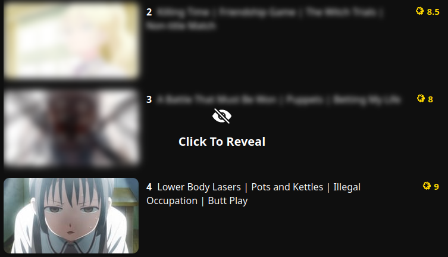

- Similar Content Section by [@IRHM] in https://github.com/sbondCo/Watcharr/pull/158

  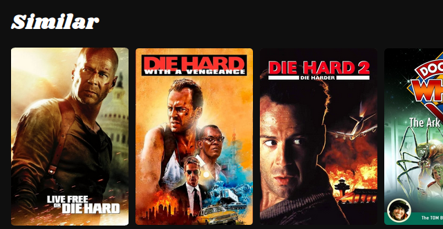

## Fixed

- Content: Fix `cast` header text scrolling out of view by [@IRHM] in https://github.com/sbondCo/Watcharr/pull/157

## Maintenance

- workflow: bump actions/checkout from 3 to 4 by @dependabot in https://github.com/sbondCo/Watcharr/pull/154
- workflow: bump docker/metadata-action from 4 to 5 by @dependabot in https://github.com/sbondCo/Watcharr/pull/152
- workflow: bump docker/login-action from 2 to 3 by @dependabot in https://github.com/sbondCo/Watcharr/pull/153
- workflow: bump docker/build-push-action from 4 to 5 by @dependabot in https://github.com/sbondCo/Watcharr/pull/155

## Etc

- **Package**: https://github.com/orgs/sbondCo/packages/container/watcharr/137585177?tag=v1.20.0

# [1.19.1] - 2023-10-14

## Maintenance

- **Update deps** by [@IRHM] in https://github.com/sbondCo/Watcharr/pull/151

## Docs

We have (sorta wip) documentation now at [watcharr.app](https://watcharr.app).

## Etc

- **Package**: https://github.com/sbondCo/Watcharr/pkgs/container/watcharr/137438778?tag=v1.19.1

# [1.19.0] - 2023-10-09

**NOTE**: Breaking changes related to server configuration. Please read below for migrating from v1.18.0 and older (tldr: moved to json configuration instead of .env file, accounts can now have admin)

## Migration

When you first run v1.19.0, a `watcharr.json` file will be created in the data directory. A new JWT_SECRET will be automatically generated. If you want to avoid logging users out, you can copy over the secret from your .env file.

You will also have to migrate any other configuration, but this can be done via the new web ui.

If you are using docker, you can remove the `.env` file volume and delete the file.

**NOTE**: If you want to use a jellyfin account as the admin, but jellyfin login has now been disabled (because your server url is not in the new config), you have two options at the moment:

1. Manually edit the `watcharr.json` config file and add your jellyfin host (add JELLYFIN_HOST):
   ```
   {
     "JWT_SECRET": "my_secret...",
     "JELLYFIN_HOST": "https://jellyfin.example.com"
   }
   ```
2. Create a new normal watcharr account, give it admin (using the `request_admin` page, see below..), set the Jellyfin Host setting in the web ui. Then logout and you will be able to login with your jellyfin account. Repeat the process to give admin to this account too.

## Server Settings Web UI

Admins can now manage the server settings through the new web ui. Changes are reflected immediately and are saved to the `watcharr.json` file.

If your account has admin, simply navigate to the face menu then click the settings option.

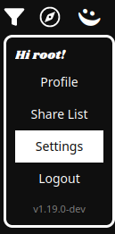

Here you can easily configure your server.

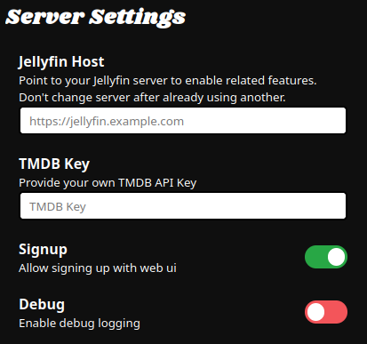

## Getting admin on an existing account

If you have an existing account you would like to give admin to, you can go to `127.0.0.1:3080/request_admin`. Click the `request` button and retrieve the token from your server log (in the data folder: `data/watcharr.log`. or with `docker compose logs`).

1. Click request button
   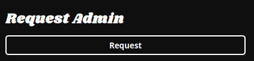
2. Retrieve token from `watcharr.log` server log file:
   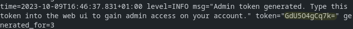
3. Type code in and get admin:
   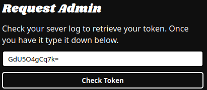

## What's Changed

Changelog simplified since all PRs relate to giving admin users the ability to modify server settings through web ui.

- Admin users and json config by [@IRHM] in https://github.com/sbondCo/Watcharr/pull/141
- Admin tokens by [@IRHM] in https://github.com/sbondCo/Watcharr/pull/142
- Web UI Server Settings by [@IRHM] in https://github.com/sbondCo/Watcharr/pull/144
- config: Fix panic if `v` unset in `updateConfig` by [@IRHM] in https://github.com/sbondCo/Watcharr/pull/145
- Update userinfo after get admin by [@IRHM] in https://github.com/sbondCo/Watcharr/pull/146
- v1.19.0 - Updated readme steps & initial config setup fix by [@IRHM] in https://github.com/sbondCo/Watcharr/pull/147

# [1.18.0] - 2023-09-24

## New

- Watched List Filtering by [@IRHM] in https://github.com/sbondCo/Watcharr/pull/133
  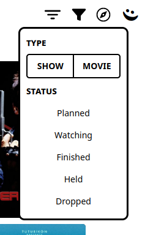

## Fixed

- Fix import page loading without auth by [@IRHM] in https://github.com/sbondCo/Watcharr/pull/134
- Content: Fix 'play on jellyfin' btn by [@IRHM] in https://github.com/sbondCo/Watcharr/pull/135
- Nav menu dark theme fixes by [@IRHM] in https://github.com/sbondCo/Watcharr/pull/139

## Etc

- **Package**: https://github.com/sbondCo/Watcharr/pkgs/container/watcharr/130985205?tag=v1.18.0

# [1.17.0] - 2023-09-19

## New

- Importing text watch list by [@IRHM] in https://github.com/sbondCo/Watcharr/pull/132

  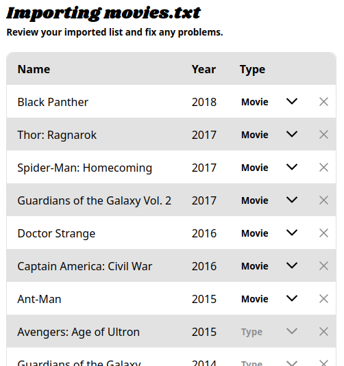

## Etc

- **Package**: https://github.com/sbondCo/Watcharr/pkgs/container/watcharr/129485637?tag=v1.17.0

# [1.16.1] - 2023-09-15

📣 An inconvenient computer failure left me without anything to work on, going to be working on getting more regular updates out from now on.

## Changed

- 📖 README: Update demo badge url by [@IRHM] in https://github.com/sbondCo/Watcharr/pull/128
- 🧭 Make Nav Sticky by [@IRHM] in https://github.com/sbondCo/Watcharr/pull/126

## Fixed

- 🥇 Do not fail on `.env` file missing thanks to [@stavros-k] in https://github.com/sbondCo/Watcharr/pull/131

## New Contributors

- [@stavros-k] made their first contribution in https://github.com/sbondCo/Watcharr/pull/131

## Etc

- **Package**: https://github.com/sbondCo/Watcharr/pkgs/container/watcharr/128451187?tag=v1.16.1

# [1.16.0] - 2023-08-27

## New in [#125](https://github.com/sbondCo/Watcharr/pull/125) Socializing

- 🔎 When searching, if a user is found with a username LIKE the search query, they are displayed at the top of the results.
- 🎞️ Clicking a user result will allow you to look at their watched list.
- 🕵️‍♂️ Added a new setting, `private`, which when toggled, will remove your profile from displaying in search results.
- 🔘 Added `Share List` button to nav face menu (copies link of your public watched list to clipboard).

## Fixed in [#125](https://github.com/sbondCo/Watcharr/pull/125)

- Long names overflowing in `Profile` page.

## Etc

- **Package**: https://github.com/orgs/sbondCo/packages/container/watcharr/122354946?tag=v1.16.0

# [1.15.0] - 2023-08-26

## Changed

- Add year to Poster by [@kurtmgray] in https://github.com/sbondCo/Watcharr/pull/111
- Optimize images by @imgbot in https://github.com/sbondCo/Watcharr/pull/118
- TMDB Request Caching by [@IRHM] in https://github.com/sbondCo/Watcharr/pull/119
- Loading Notifications (better feedback on slower networks) by [@IRHM] in https://github.com/sbondCo/Watcharr/pull/122

## Fixed

- PersonPoster: Fix white flash on hover by [@IRHM] in https://github.com/sbondCo/Watcharr/pull/120 (**Thanks @DNYLA for reporting**)
- Content: Omit ReleaseDate if not set by [@IRHM] in https://github.com/sbondCo/Watcharr/pull/123

## New Contributors

- [@kurtmgray] made their first contribution in https://github.com/sbondCo/Watcharr/pull/111 (**Thanks!**)
- @imgbot made their first contribution in https://github.com/sbondCo/Watcharr/pull/118

## Etc

- **Package**: https://github.com/sbondCo/Watcharr/pkgs/container/watcharr/122231066?tag=v1.15.0

# [1.14.0] - 2023-08-21

## New

- Support disabling signup in https://github.com/sbondCo/Watcharr/pull/104
- Support using a custom TMDB_KEY in https://github.com/sbondCo/Watcharr/pull/116
- 🔎 Discover Page in https://github.com/sbondCo/Watcharr/pull/109
- New sorting options: Rating, Last Changed in https://github.com/sbondCo/Watcharr/pull/110

## Changed

- 🎥 Show a better empty watched list message in https://github.com/sbondCo/Watcharr/pull/105
- 🖼️ Fade out content backdrop in https://github.com/sbondCo/Watcharr/pull/106

## Fixed

- SeasonsList: Stop requesting season 1 twice in https://github.com/sbondCo/Watcharr/pull/115

## Etc

- **Package**: https://github.com/sbondCo/Watcharr/pkgs/container/watcharr/120648411?tag=v1.14.0

# [1.13.0] - 2023-08-18

**Note:** Auth related improvements require a re-login from the user. You should notice you are automatically logged out after updating to this version.

## New

- Streaming Providers shown for content by @DNYLA in https://github.com/sbondCo/Watcharr/pull/97
- Play In Jellyfin Button / Providers by [@IRHM] in https://github.com/sbondCo/Watcharr/pull/101
- Server Logging To File by [@IRHM] in https://github.com/sbondCo/Watcharr/pull/95

## Changed

- Show `TBD` if seasons not aired and add no episodes message by [@IRHM] in https://github.com/sbondCo/Watcharr/pull/90
- Hide tv runtimes if not provided in episode_run_time array by [@IRHM] in https://github.com/sbondCo/Watcharr/pull/92

## Maintenance

- Update Client And Server Dependencies by [@IRHM] in https://github.com/sbondCo/Watcharr/pull/88

## New Contributors

- @DNYLA made their first contribution in https://github.com/sbondCo/Watcharr/pull/97

## Etc

- **Package**: https://github.com/sbondCo/Watcharr/pkgs/container/watcharr/120038591?tag=v1.13.0

# [1.12.0] - 2023-08-14

## New

- Show public ratings for movies and tv (from TheMovieDB) in https://github.com/sbondCo/Watcharr/pull/73
- Episode ratings (from TheMovieDB) in https://github.com/sbondCo/Watcharr/pull/74 and https://github.com/sbondCo/Watcharr/pull/77
- Trailers for movies and shows (YouTube Embed) by [@IRHM] in https://github.com/sbondCo/Watcharr/pull/76

## Etc

- **Package**: https://github.com/orgs/sbondCo/packages/container/watcharr/118290077?tag=v1.12.0

# [1.11.0] - 2023-08-09

## New

- Dark theme (changeable in profile page) in https://github.com/sbondCo/Watcharr/pull/63
- Give and save your thoughts on a movie/series in https://github.com/sbondCo/Watcharr/pull/69

## Changed

- Show success notifications after adding/updating watched items in https://github.com/sbondCo/Watcharr/pull/69

## Fixed

- Make profile page responsive in https://github.com/sbondCo/Watcharr/pull/64

# [1.10.0] - 2023-07-22

## New

#### Watched Page Filters in https://github.com/sbondCo/Watcharr/pull/51

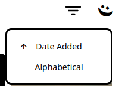

#### TV Seasons/Episodes in https://github.com/sbondCo/Watcharr/pull/52

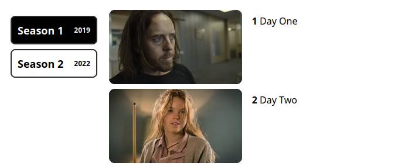

#### Content Activity in https://github.com/sbondCo/Watcharr/pull/53

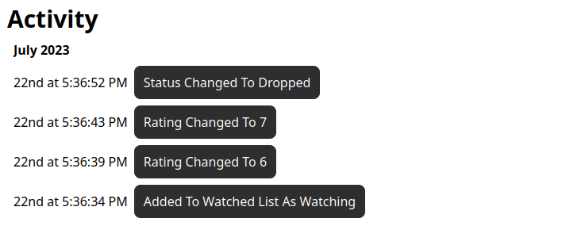

#### Profile (bare bones at the moment) in https://github.com/sbondCo/Watcharr/pull/55

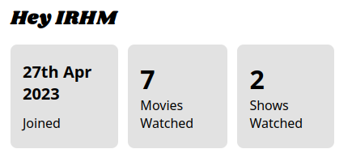

## Fixed

- Nav DropDowns: Close other menu on open in https://github.com/sbondCo/Watcharr/pull/57

## Etc

- **Package**: https://github.com/sbondCo/Watcharr/pkgs/container/watcharr/111775794?tag=v1.10.0

# [1.9.2] - 2023-06-01

## Fixed

- Routing in production app in https://github.com/sbondCo/Watcharr/commit/80b808c39e842ab2bbd1da4f607f7b34f4d14fb0

# [1.9.1] - 2023-05-31

## Changed

- Simplified Setup (only one docker image and removed the need for a reverse proxy) in https://github.com/sbondCo/Watcharr/pull/50

# [1.9.0] - 2023-05-30

## 🎥 The Cast Update

## New

- Display Cast in content pages in https://github.com/sbondCo/Watcharr/pull/43
- Create notification popups in https://github.com/sbondCo/Watcharr/pull/36
- Show username at top of face menu in https://github.com/sbondCo/Watcharr/pull/38

## Changed

- Move api.ts and helpers.ts to util folder in https://github.com/sbondCo/Watcharr/pull/39
- Move calculateTransformOrigin to helpers and use it in person poster too in https://github.com/sbondCo/Watcharr/pull/48

## Fixed

- Posters out of view on hover in https://github.com/sbondCo/Watcharr/pull/47
- Increase search debounce time on mobile in https://github.com/sbondCo/Watcharr/pull/34
- Posters Doubly Scaling in https://github.com/sbondCo/Watcharr/pull/49

# [1.8.0] - 2023-05-17

## 🤺 The People Update

## New

- Support Showing People In Search and person page with their content in https://github.com/sbondCo/Watcharr/pull/28, #33
- Display version in face menu and in console in https://github.com/sbondCo/Watcharr/pull/31

## Changed

- Only show available auth providers on login page in https://github.com/sbondCo/Watcharr/pull/29

## Fixed

- Remove x padding on movies in person page in https://github.com/sbondCo/Watcharr/pull/32

# [1.7.0] - 2023-05-09

🦸 Watcharr is coming together!

## New

- Tooltips (for watched statuses only at the moment, since they can be confusing) in https://github.com/sbondCo/Watcharr/pull/13
- Loading icons and better Errors in https://github.com/sbondCo/Watcharr/pull/14
- Support removing watched list items in https://github.com/sbondCo/Watcharr/pull/24

## Changed

- New font for logo, nav and headers `Shrikhand`
- Fonts now loaded from locally served files

## Fixed

- Chrome issues with navbar and posters in https://github.com/sbondCo/Watcharr/pull/15
- Fix tooltips position whilst page is scrolled in https://github.com/sbondCo/Watcharr/pull/16
- Fix poster tooltips not hiding after touch stops, bottom of page on mobile tv/movie pages being wrong bg color & nav logo width increasing on hover in https://github.com/sbondCo/Watcharr/pull/17
- Fix adding watched list item when content exists in https://github.com/sbondCo/Watcharr/pull/24
- Fix small nav logo width in https://github.com/sbondCo/Watcharr/pull/25

# [1.6.0] - 2023-04-25

⚠️ Breaking - Content table now stores tmdb ids in its own column (`tmdb_id` instead of `id`).

## Changed

- Show smaller nav on mobile, instead of nothing, so we can still navigate to home page
- Reduce margin on x axis, so we can show 2 columns of posters on mobile

## Fixed

- Not handling possible duplicate tmdb ids (a show and movie can have same id on tmdb)
- Posters on mobile

# [1.5.0] - 2023-04-21

:tada: Watcharr should hopefully be a lot more stable as of this release, it has been tested to the best of my ability. There are some more issues, that will be fixed shortly, but for the most part it works.

## New

- Movie and TV details pages (currently with full overview, runtime, etc.. more details coming soon)

## Changed

- No hover needed on poster if img not set by [@IRHM] in https://github.com/sbondCo/Watcharr/pull/3
- Posters have been redesigned
- Posters are more keyboard friendly
- More content statuses ("PLANNED" | "WATCHING" | "FINISHED" | "HOLD" | "DROPPED")
- Ratings changed from 5 stars to 10 stars
- Nav effects on hover
- More responsive design (hiding elements on nav, shortening margins, etc)

## Fixed

- Server dockerfile not having ca-certificates package - causing https requests to fail
- Watched posters using localhost in production
- Dont handleSearch if key pressed is not a letter (Tab, caps, meta, etc), so we don't search when we don't need to. Also fixes tabbing through UI, which could cause a search.

# [1.4.0] - 2023-04-14

## New

- Jellyfin login support (JELLYFIN_HOST environment variable needs to be set)

## Changed

- Panic if database auto migration fails
- UI: Remove local token on 401, then redirect to login

## Fixed

- UI: Normal auth login interceptors
- UI: Clear `watchedList` store on logout, to avoid seeing another users list on login with a different account

# [1.3.0] - 2023-04-12

## Fixes

- UI: Auth interceptor.

## New

- UI: Nav submenu for logging out.

# [1.2.0] - 2023-04-11

## Fixes

- Server: Ensure data dir exists on startup
- UI: Rating change not working on content search page
- Repo: Fixed example Caddyfile showing reverse proxy setup

## Changed

- Server: Default watched status is now `Watching` (used to be `Finished`)
- UI: Login/Register page now has it's own layout
- UI: Replaced custom `req` method with request interceptors - redirect to login should work better when auth fails or token not found

# [1.1.0] - 2023-04-11

## Welcome :tada:

Welcome to Watcharr :popcorn:, hope it is enjoyed and improves anyone's experience and upgrades their .txt file!

## Fixes :lab_coat:

- Server: Fix User model
- UI: Add password type to pass input on login/register
- UI: Use `req` method for login/registering - so correct api url is used

<!-- Version Changelog References (newest first) -->

[Unreleased]: https://github.com/sbondCo/Watcharr/compare/v4.0.0...HEAD
[4.2.1]: https://github.com/sbondCo/Watcharr/compare/v4.2.0...v4.2.1
[4.2.0]: https://github.com/sbondCo/Watcharr/compare/v4.1.1...v4.2.0
[4.1.1]: https://github.com/sbondCo/Watcharr/compare/v4.1.0...v4.1.1
[4.1.0]: https://github.com/sbondCo/Watcharr/compare/v4.0.1...v4.1.0
[4.0.1]: https://github.com/sbondCo/Watcharr/compare/v4.0.0...v4.0.1
[4.0.0]: https://github.com/sbondCo/Watcharr/compare/v3.0.1...v4.0.0
[3.0.1]: https://github.com/sbondCo/Watcharr/compare/v3.0.0...v3.0.1
[3.0.0]: https://github.com/sbondCo/Watcharr/compare/v2.1.1...v3.0.0
[2.1.1]: https://github.com/sbondCo/Watcharr/compare/v2.1.0...v2.1.1
[2.1.0]: https://github.com/sbondCo/Watcharr/compare/v2.0.2...v2.1.0
[2.0.2]: https://github.com/sbondCo/Watcharr/compare/v2.0.1...v2.0.2
[2.0.1]: https://github.com/sbondCo/Watcharr/compare/v2.0.0...v2.0.1
[2.0.0]: https://github.com/sbondCo/Watcharr/compare/v1.44.2...v2.0.0
[1.44.2]: https://github.com/sbondCo/Watcharr/compare/v1.44.1...v1.44.2
[1.44.1]: https://github.com/sbondCo/Watcharr/compare/v1.44.0...v1.44.1
[1.44.0]: https://github.com/sbondCo/Watcharr/compare/v1.43.0...v1.44.0
[1.43.0]: https://github.com/sbondCo/Watcharr/compare/v1.42.0...v1.43.0
[1.42.0]: https://github.com/sbondCo/Watcharr/compare/v1.41.0...v1.42.0
[1.41.0]: https://github.com/sbondCo/Watcharr/compare/v1.40.0...v1.41.0
[1.40.0]: https://github.com/sbondCo/Watcharr/compare/v1.39.0...v1.40.0
[1.39.0]: https://github.com/sbondCo/Watcharr/compare/v1.38.2...v1.39.0
[1.38.2]: https://github.com/sbondCo/Watcharr/compare/v1.38.1...v1.38.2
[1.38.1]: https://github.com/sbondCo/Watcharr/compare/v1.38.0...v1.38.1
[1.38.0]: https://github.com/sbondCo/Watcharr/compare/v1.37.0...v1.38.0
[1.37.0]: https://github.com/sbondCo/Watcharr/compare/v1.36.0...v1.37.0
[1.36.0]: https://github.com/sbondCo/Watcharr/compare/v1.35.2...v1.36.0
[1.35.2]: https://github.com/sbondCo/Watcharr/compare/v1.35.1...v1.35.2
[1.35.1]: https://github.com/sbondCo/Watcharr/compare/v1.35.0...v1.35.1
[1.35.0]: https://github.com/sbondCo/Watcharr/compare/v1.34.0...v1.35.0
[1.34.0]: https://github.com/sbondCo/Watcharr/compare/v1.33.0...v1.34.0
[1.33.0]: https://github.com/sbondCo/Watcharr/compare/v1.32.1...v1.33.0
[1.32.1]: https://github.com/sbondCo/Watcharr/compare/v1.32.0...v1.32.1
[1.32.0]: https://github.com/sbondCo/Watcharr/compare/v1.31.1...v1.32.0
[1.31.1]: https://github.com/sbondCo/Watcharr/compare/v1.31.0...v1.31.1
[1.31.0]: https://github.com/sbondCo/Watcharr/compare/v1.30.0...v1.31.0
[1.30.0]: https://github.com/sbondCo/Watcharr/compare/v1.29.0...v1.30.0
[1.29.0]: https://github.com/sbondCo/Watcharr/compare/v1.28.0...v1.29.0
[1.28.0]: https://github.com/sbondCo/Watcharr/compare/v1.27.0...v1.28.0
[1.27.0]: https://github.com/sbondCo/Watcharr/compare/v1.26.0...v1.27.0
[1.26.0]: https://github.com/sbondCo/Watcharr/compare/v1.25.0...v1.26.0
[1.25.0]: https://github.com/sbondCo/Watcharr/compare/v1.24.0...v1.25.0
[1.24.0]: https://github.com/sbondCo/Watcharr/compare/v1.23.0...v1.24.0
[1.23.0]: https://github.com/sbondCo/Watcharr/compare/v1.22.0...v1.23.0
[1.22.0]: https://github.com/sbondCo/Watcharr/compare/v1.21.1...v1.22.0
[1.21.1]: https://github.com/sbondCo/Watcharr/compare/v1.21.0...v1.21.1
[1.21.0]: https://github.com/sbondCo/Watcharr/compare/v1.20.1...v1.21.0
[1.20.1]: https://github.com/sbondCo/Watcharr/compare/v1.20.0...v1.20.1
[1.20.0]: https://github.com/sbondCo/Watcharr/compare/v1.19.1...v1.20.0
[1.19.1]: https://github.com/sbondCo/Watcharr/compare/v1.19.0...v1.19.1
[1.19.0]: https://github.com/sbondCo/Watcharr/compare/v1.18.0...v1.19.0
[1.18.0]: https://github.com/sbondCo/Watcharr/compare/v1.17.0...v1.18.0
[1.17.0]: https://github.com/sbondCo/Watcharr/compare/v1.16.1...v1.17.0
[1.16.1]: https://github.com/sbondCo/Watcharr/compare/v1.16.0...v1.16.1
[1.16.0]: https://github.com/sbondCo/Watcharr/compare/v1.15.0...v1.16.0
[1.15.0]: https://github.com/sbondCo/Watcharr/compare/v1.14.0...v1.15.0
[1.14.0]: https://github.com/sbondCo/Watcharr/compare/v1.13.0...v1.14.0
[1.13.0]: https://github.com/sbondCo/Watcharr/compare/v1.12.0...v1.13.0
[1.12.0]: https://github.com/sbondCo/Watcharr/compare/v1.11.0...v1.12.0
[1.11.0]: https://github.com/sbondCo/Watcharr/compare/v1.10.0...v1.11.0
[1.10.0]: https://github.com/sbondCo/Watcharr/compare/v1.9.2...v1.10.0
[1.9.2]: https://github.com/sbondCo/Watcharr/compare/v1.9.1...v1.9.2
[1.9.1]: https://github.com/sbondCo/Watcharr/compare/v1.9.0...v1.9.1
[1.9.0]: https://github.com/sbondCo/Watcharr/compare/v1.8.0...v1.9.0
[1.8.0]: https://github.com/sbondCo/Watcharr/compare/v1.7.0...v1.8.0
[1.7.0]: https://github.com/sbondCo/Watcharr/compare/v1.6.0...v1.7.0
[1.6.0]: https://github.com/sbondCo/Watcharr/compare/v1.5.0...v1.6.0
[1.5.0]: https://github.com/sbondCo/Watcharr/compare/v1.4.0...v1.5.0
[1.4.0]: https://github.com/sbondCo/Watcharr/compare/v1.3.0...v1.4.0
[1.3.0]: https://github.com/sbondCo/Watcharr/compare/v1.2.0...v1.3.0
[1.2.0]: https://github.com/sbondCo/Watcharr/compare/v1.1.0...v1.2.0
[1.1.0]: https://github.com/sbondCo/Watcharr/compare/v1.0.0...v1.1.0

<!-- Contributor References (oldest first) -->

[@IRHM]: https://github.com/IRHM
[@kurtmgray]: https://github.com/kurtmgray
[@stavros-k]: https://github.com/stavros-k
[@simonbcn]: https://github.com/simonbcn
[@MathieuMoalic]: https://github.com/MathieuMoalic
[@ishaanparlikar]: https://github.com/ishaanparlikar
[@iamericfletcher]: https://github.com/iamericfletcher
[@Contrillion-2]: https://github.com/Contrillion-2
[@schmurian]: https://github.com/schmurian
[@sahinakkaya]: https://github.com/sahinakkaya
[@stephaje]: https://github.com/stephaje
[@n00b12345]: https://github.com/n00b12345
[@priyajit4u]: https://github.com/priyajit4u
[@stignarnia]: https://github.com/stignarnia
[@mommyune]: https://github.com/cerxil
[@gardebreak]: https://github.com/gardebreak
[@rguinn829]: https://github.com/rguinn829
[@oPisiti]: https://github.com/oPisiti
[@yamerooo123]: https://github.com/yamerooo123
[@AlexPerathoner]: https://github.com/AlexPerathoner
[@senz]: https://github.com/senz
[@SirMartin]: https://github.com/SirMartin
[@lufixSch]: https://github.com/lufixSch
[@christaikobo]: https://github.com/christaikobo
[@antoniosarro]: https://github.com/antoniosarro
[@Clusters]: https://github.com/Clusters
[@jigglycrumb]: https://github.com/jigglycrumb
[@IvanBeke]: https://github.com/IvanBeke
[@ParksideParade]: https://github.com/ParksideParade
[@Dredsen]: https://github.com/Dredsen
[@GreatGatsby102]: https://github.com/GreatGatsby102
[@4qu4r1um]: https://github.com/4qu4r1um
[@goestav]: https://github.com/goestav
[@tonghuaroot]: https://github.com/tonghuaroot
[@KarpachMarko]: https://github.com/KarpachMarko
