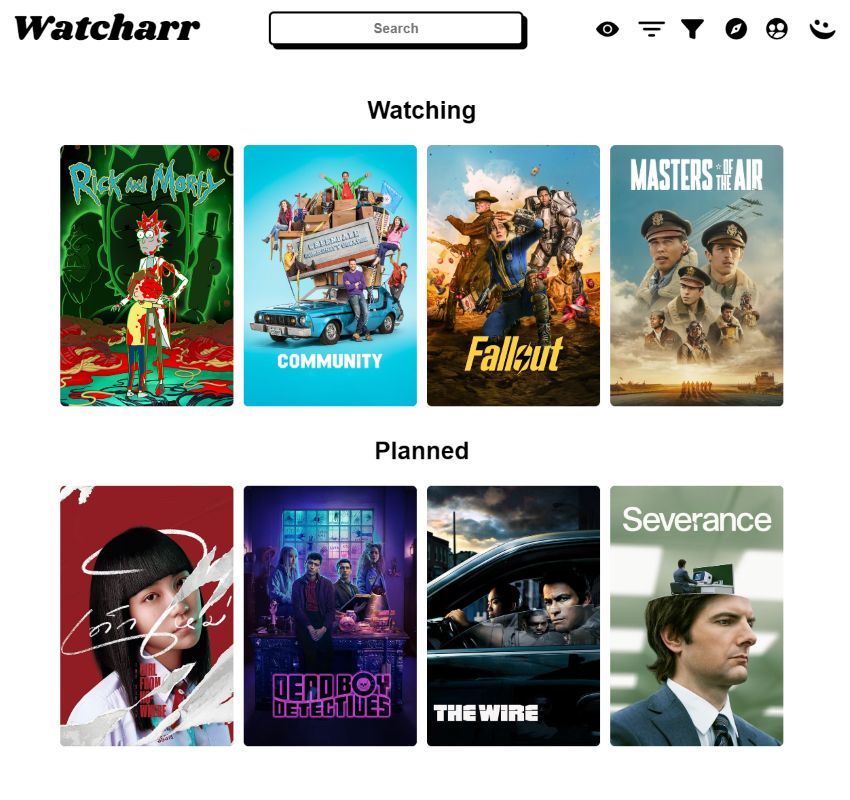
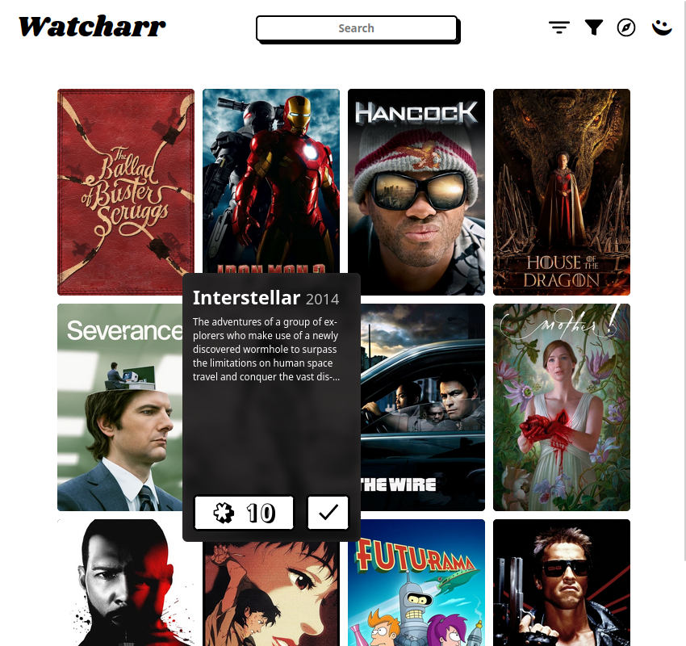

<h1 align="center">Watcharr</h1>
<p align="center"></p>

<p align="center">
  <a href="https://github.com/sbondCo/Watcharr/pkgs/container/watcharr"></a>
  <a href="https://watcharr.lab.sbond.co"></a>
  <a href="https://github.com/sbondCo/Watcharr/issues"></a>
  <a href="/LICENSE"></a>
</p>

I'm your new easily self-hosted content watched list. The place you store your watched (or watching, planned, etc) movies and tv shows, rate them and track their status.

I am built with Go and Svelte(Kit).

Feel free to abuse this demo instance (nicely), which runs on the latest `dev` build (there may be bugs, as new features are tested on here too): [https://watcharr.lab.sbond.co/](https://watcharr.lab.sbond.co/)

[Track Progress Until Next Version](https://github.com/orgs/sbondCo/projects/9/views/3)

### Contents

- [Screenshots](#screenshots)
- [Setup](#set-up)
- [Contributing](CONTRIBUTING.md)
- [Getting Help](#getting-help)

# Screenshots

<h3 align="center">Watched List</h3>
<p align="center">


| Watched Show Hover                                                      | Watched Show Status Change                                                              | Show Details                                                                |
| ----------------------------------------------------------------------- | --------------------------------------------------------------------------------------- | --------------------------------------------------------------------------- |
|  |  |  |

</p>

# Set Up

Currently only a [docker image](https://github.com/sbondCo/Watcharr/pkgs/container/watcharr) is provided (**v1.9.1 and newer no longer require the `watcharr-ui` package, it is bundled inside the main `watcharr` package**).

Here is a simple setup you can use yourself, using docker compose:

**docker-compose.yml**

```
version: "3"

services:
  watcharr:
    # The :latest tag is used for simplicity, it is recommended
    # to use an actual version, then when updating check the releases for changelogs.
    image: ghcr.io/sbondco/watcharr:latest
    container_name: watcharr
    ports:
      - 3080:3080
    volumes:
      # .env file used to configure watcharr
      - .env:/.env
      # Contains all of watcharr data (database & cache)
      - ./data:/data
```

**.env**

```
# Used to sign JWT tokens. Make sure to make
# it strong, just like a very long, complicated password.
JWT_SECRET=MAKE_ME_RANDOM_AND_LONG

# Optional: Point to your Jellyfin install
# to enable it as an auth provider.
JELLYFIN_HOST=https://my.jellyfin.example

# Enable/disable signup functionality.
# Set to `false` to disable registering an account.
SIGNUP_ENABLED=true

# Optional: Provide your own TMDB API Key.
# If unprovided, the default Watcharr API key will be used.
# TMDB_KEY=

# Enable/disable debug logging. Useful for when trying
# to figure out exactly what the server is doing at a point
# of failure.
# Set to `true` to enable.
DEBUG=false

# Optional: When not set we assume production, should only
# be set to DEV when developing the app.
MODE=prod
```

# Getting Help

If something isn't working for you or you are stuck, [creating an issue](https://github.com/sbondCo/Watcharr/issues/new) is the best way to get help! Every type of issue is accepted, so don't be afraid to ask anything!
