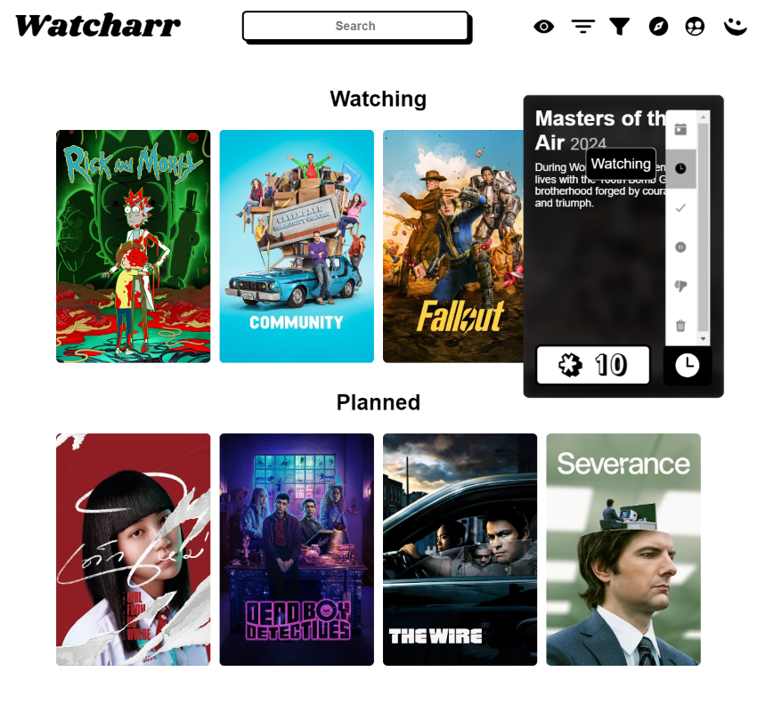

<h1 align="center">Watcharr</h1>
<p align="center"></p>

I'm the place you store your watched content for later rememberance, sadly I am still in my infancy. I aspire to be easily self hosted.

I am built with Go and Svelte(Kit).

Feel free to abuse this demo instance (nicely), which runs on the latest `dev` build (there may be bugs, as new features are tested on here too before release): [https://watcharr.lab.sbond.co/](https://watcharr.lab.sbond.co/)

# Screenshots

<h3 align="center">Watched List</h3>
<p align="center">


| Watched Show Hover                                                      | Watched Show Status Change                                                              | Show Details                                                                |
| ----------------------------------------------------------------------- | --------------------------------------------------------------------------------------- | --------------------------------------------------------------------------- |
|  |  |  |

</p>

# Set Up

Currently only a [docker image](https://github.com/sbondCo/Watcharr/pkgs/container/watcharr) is provided.

Here is a simple setup you can use yourself, using docker compose:

**docker-compose.yml**

```
version: "3"

services:
  watcharr:
    # The :latest tag is used for simplicity, it is recommended
    # to use an actual version, then when updating check the releases for changelogs.
    image: ghcr.io/sbondco/watcharr:latest
    container_name: watcharr
    ports:
      - 3080:3080
    volumes:
      # .env file used to configure watcharr
      - .env:/.env
      # Contains all of watcharr data (database & cache)
      - ./data:/data
```

**.env**

```
# Used to sign JWT tokens. Make sure to make
# it strong, just like a very long, complicated password.
JWT_SECRET=MAKE_ME_RANDOM_AND_LONG

# Optional: Point to your Jellyfin install
# to enable it as an auth provider.
JELLYFIN_HOST=https://my.jellyfin.example

# Optional: When not set we assume production, when set to
# DEV extra logging will appear which could help solve issues.
MODE=prod
```
