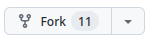

# For Development

This guide will help you setup Watcharr for development in your local environment.

## Setup

This section assumes you will be forking the repo on Github, of course you can alter this section to work with your workflow, but if you intend to create a pull request with your work, it may be difficult if you're not also using Github (I don't know :()).

1. Fork the repository

   On GitHub you can fork the repository with the 'Fork' button at the top.

   

2. Get the code by cloning your fork

   ```bash
   git clone https://github.com/<your username>/Watcharr.git && \
   cd Watcharr
   ```

## Setting Up Dependencies

You only need to do this once after pulling the codebase for the first time, and again every time the dependencies are changed/updated.

1. Install frontend dependencies (in the project root folder)

   ```
   npm i
   ```

2. Install server dependencies (in the `server` folder)

   ```
   go get .
   ```

## Running The Code

To run the code, you will need to open up two terminals, one for the frontend and the other for the backend.

1. Run the frontend (first terminal, in the project root folder)

   ```bash
   npm run dev
   ```

2. Run the server (second terminal, in the project root folder)

   ```bash
   npm run server
   ```

   **Note:** If you're using Windows, running the server can be a little more complicated. You can follow this: https://github.com/sbondCo/Watcharr/discussions/430#discussioncomment-8894110 which amounts to these steps (the first 3 steps only need to be done once):

   1. Set CGO_ENABLED environment variable with go

      ```
      go env -w CGO_ENABLED=1
      ```

   2. Install `gcc` (if you don't already have it installed) from https://jmeubank.github.io/tdm-gcc/ (found from this answer on stackoverflow: https://stackoverflow.com/a/43588236).

   3. Install server dependencies again with `go get .` in the `server` folder.

   4. Manually run the server, setting the MODE environment variable in powershell (from the `server` folder)

      ```
      cmd /V /C "set MODE=DEV&& go run ."
      ```

3. Visit [http://localhost:5173/](http://localhost:5173/) and setup Watcharr.
