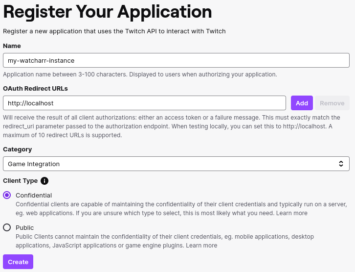
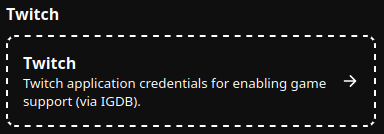
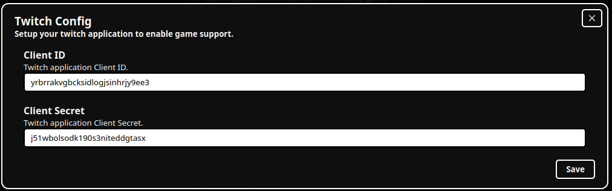
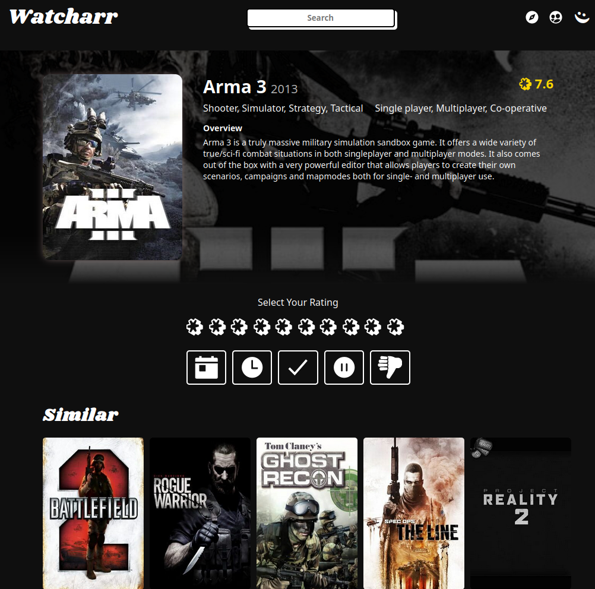

# Games Support (via IGDB/Twitch)

## Overview

Game support in Watcharr, currently, must be enabled by you.

This involves setting up a Twitch developer account (phone number needed for 2FA which is required) and entering application credentials into Watcharr, that can then be used for looking up game info via IGDB.

P.S. These steps are stolen from [igdb api docs](https://api-docs.igdb.com/#account-creation), I've tried to make it easier to follow with screenshots.

## Steps

### Setup On Twitch

1. Sign up for a [Twitch](https://dev.twitch.tv/login) account.
   Click login with twitch, then create an account in the Sign Up tab.
2. Enable two factor authentication in your [account Security settings](https://www.twitch.tv/settings/security) (currently requires a phone number).
3. [Register a new Application in the Twitch Developer Console](https://dev.twitch.tv/console/apps/create).
   These settings will do (name can be anything, we don't use OAuth, but a redirect url is required; localhost will do):

   

4. [Click manage](https://dev.twitch.tv/console/apps) on your newly created application.
5. Click 'New Secret' to generate a new Client Secret.
6. Take a note of your Client ID and new Client Secret (by leaving this tab open, until we are ready to copy the values into Watcharr).

### Setup On Watcharr

1. Login to Watcharr with an Admin account and navigate to server settings.

   

2. Scroll down and click on the Twitch service.

   

3. Enter your Client ID and Client Secret (from Twitch Application page, step 6 on twitch setup steps)

   

4. Click save, and start searching for your favourite games!

   
