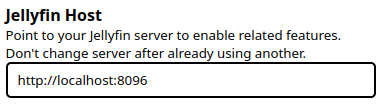

# Jellyfin Authentication

Watcharr can use your Jellyfin server as an authentication provider. There is just one simple step to set this up.

:::danger Take care

It is not recommended that this value is changed once it has been set and users have signed up.

Changing this setting can cause users to be unable to login to the correct account.

:::

## Setup Steps

1. Login to Watcharr with an Admin account and navigate to server settings.

   

2. Scroll down to find the Jellyfin Host setting and enter the URL to your Jellyfin server.

   

3. Jellyfin authentication has now been enabled! Go back to the login screen and you will be able to login via Jellyfin.
