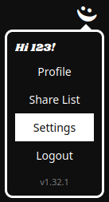

# Plex Authentication

Watcharr can use Plex as an authentication provider. There is just one simple step to set this up.

## Setup Steps

1. Login to Watcharr with an Admin account and navigate to server settings.

   

2. Scroll down and find the Plex Host setting.

   

3. Enter the URL to your home Plex server.
   You will see your Plex machine identifier popup below the input after it's saved, if it worked.
   Only users with access to your library will be able to signup via Plex.

   
