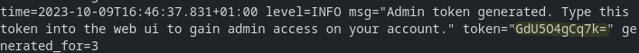
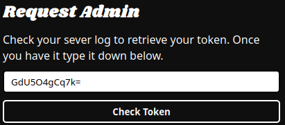

# Restoring Admin Priviliges

This guide will help you restore/give admin access to any account without needing an account with admin. If you ever accidentally remove your permissions, this is the easiest way to get them back.

All you will need is access to the `watcharr.log` file.

## Steps

1. Login with the account you'd like to give admin to.

2. Navigate to the `/request_admin` page manually (ex: `127.0.0.1:3080/request_admin`) and click the `request` button.

   

3. Check your `watcharr.log` file (or simply check `docker compose logs` if using docker compose) and look for the generated admin token (highlighted in the image below).

   

4. Enter the code from the log (you should have been taken here after clicking the request button in step 2).

   

5. Click `Check Token`, if it is correct and still valid (they expire after ~2 minutes or once used), your account will now have admin.
