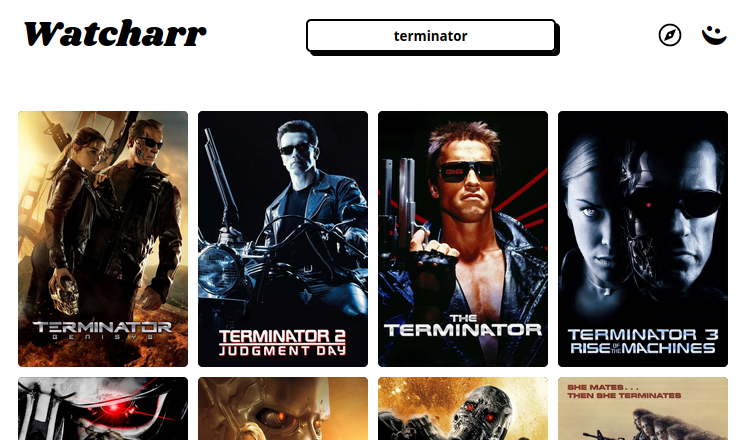
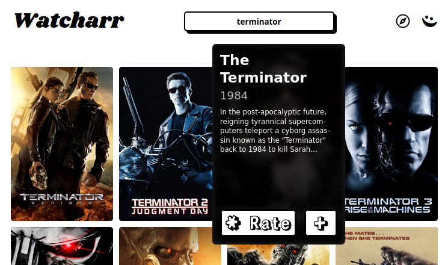
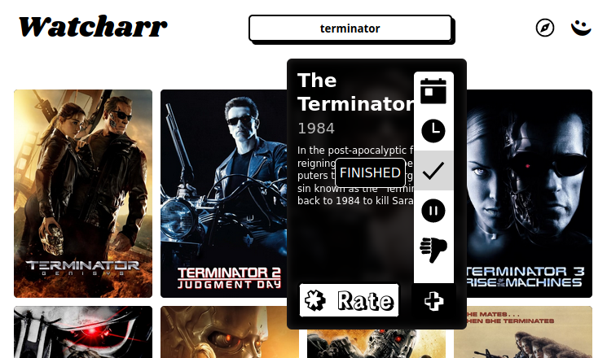
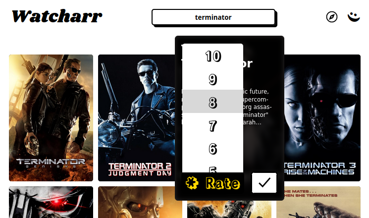

# Adding To Your Watchlist

Adding movies or shows to your watchlist is the core feature of Watcharr.

The homepage is where your list will appear once you have added some.

To get started, you can follow along with these steps to add your first movie/show:

1. Search for the content:

   

2. Hover or click on the content you want to add:

   

3. Clicking the + (Plus) icon will let you give the content a status.

   Currently supported statuses include: `Finished`, `Watching`, `Held`, `Planned`, `Dropped`.

   

4. Rate the content.

   

If you prefer, you can also do this by clicking/tapping on the active poster again.
This will take you to the contents full page. Here you can see all the options, including
adding `Thoughts` for the content.

`Thoughts` can be anything you would like to write down or remember about the specific movie/show.
For example, sometimes I like to write something specific that I _really_ liked about the content,
or for some shows, I write down my favourite seasons and how many times I have watched them.
